# Integrating DevOps Velocity with ELM to achieve Business Outcomes

## Business Scenarios covered by this demonstration:
### * [Visualize and Optimize the flow of work to improve team productivity](#business-scenario-1-visualize-and-optimize-the-flow-of-work-to-improve-team-productivity)
### * [Eliminate guess work and use data to make better investment decision for process improvement](#business-scenario-2-eliminate-guess-work-and-use-data-to-make-better-investment-decisions-for-process-improvement)

## About the Demonstration

For this demonstration, DevOps Velocity has already been integrated with ELM and value streams have been created visualizing the ELM data as stories, bugs, tasks, features and requirements. This setup allows you to focus on the features of the integrated solution and how DevOps Velocity and ELM can work together. For details on how to setup the environment, review the steps presented in the enablement section.

The following table shares information on which ELM projects have been visualized in DevOps Velocity:

| **ELM Project** | **Velocity Value Stream**  | **Additional Information** |
|:------------- |:------------- |:------------- |
|JKE Banking (Change Management) | JKE Banking Demo (Change Management) | The JKE Banking project was created in ELM using the Money that Matters sample data which includes work items in EWM and requirements added to ERM. A DevOps Velocity plugin has configured allowing the EWM data to be sync'd with Velocity and displayed in the value stream. | 
| JKE Banking (Requirements Management) | JKE Banking Demo (Requirements Management) | The JKE Banking Demo (Requirements Management) value stream is visualizing requirements synchronized by integrating DevOps Velocity with JKE Banking (Requirements Management) project.
| Meter Reader GC | Meter Reader Demo GC | This value stream is visualizing requirements synchronized with DevOPs Velocity from a ERM project which has Global Configuration enabled providing more robust requirements management capabilities enabling the use of DOORs NG components, streams and baselines. |

**NOTE:** The images provided in the steps below may not exactly match what is seen in the DevOps Velocity browser window. Understand that they are provided as a reference as you work through the demo steps.

## Understanding the Business Challenge addressed in this demonstration

Many DevOps organizations use Dora metrics or Flow metrics to measure the efficiency of their software delivery pipeline. While Flow metrics focus on the stream of work items and the efficiency of processes, Dora metrics provide insights into the effectiveness of software development and delivery practices. However, regardless of which KPIs are adopted, both provide a high level measure of the end to end software delivery process.

**DORA Metrics**

1. Deployment Frequency - How often do production releases occur?
2. Lead Time to Change - What is the length of time it takes for code changes to be made available in production?
3. Change Failure Rate - What is the frequency of deployments which cause an issue in production?
4. Mean Time to Recovery - What is the length of time it takes to recover from the production issue?

**Flow Metrics**

1. Flow Time: Is time-to-market getting shorter?
2. Flow Velocity: Is value delivery accelerating? 
3. Flow Efficiency: Is upstream work holding up delivery?
4. Flow Load: Is demand vs capacity being balanced?
5. Flow Distribution: Are we investing in both value generation and protection?

Now it is a well know fact that any process is only as fast as its slowest point (Theory of Constraints). And all processes have at least one slow point. The "trick" is to find the bottleneck(s), take action to improve, and measure the outcome (better - same - worse) to understand if the desired result was achieved.

Using these high level metrics and armed with a desire to improve, the next typical step would be for the organization to execute a Value Stream Mapping exercise assembling a team of people to share their experience and opinions on how long each stage of the end to end process takes and recording this information on a value stream map - value add time (VA), non-value add time (NVA), process efficiency (PE) - for each individual stage in their process. This can be a very expensive and laboreous process where the outcome is only valid until some improvement action is implemented. Because, once the process improvement is implemented, the bottleneck will probably move to another location in the delivery pipeline. Meaning, value stream mapping is not a one time exercise and should be a regular activity on one's journey to optimization.

The alternative to Value Stream Mapping is Value Stream Management. A Value Stream Management solution, like DevOps Velocity, is continuously ingesting data from the various tools used in the software delivery pipeline and presenting that data in a holistic dashboard providing insight, in almost real time, on not only how efficient the entire software delivery pipeline is but also where in the pipeline opportunities for improvement exist. Value Stream Management is a much more scientific approach eliminating the guess work and helping teams make better decisions on where to improve using data instead of making decisions based on opinion.

DevOps Velocity helps organizations by visualizing delivery pipeline data in a holistic dashboard allowing teams to make accurate decisions on where to invest in process improvement for the purpose of optimizing flow and achieving the desired business outcomes.

## Introducing DevOps Velocity

The DevOps Velocity value stream’s view provides a strategic window into your life-cycle workflow while simultaneously enabling you to drill-down and monitor individual elements with the intent of optimizing pipeline flow. These elements typically represent work items/issues, commits, pull requests, builds, deployments, and tests that are collected from many tools making up your delivery pipeline and integrated into Velocity via plugins. Individual elements are represented graphically by small circles, squares, or triangles, depending on the type, providing information from logically related tools, such as issues managed in an ALM solution linked to one’s source control management (SCM) system. How elements are visualized in a DevOps Velocity value stream can be simple to very complex. You are only limited by your knowledge of how to architect a value stream.

The pipeline capability enables organizations to drive releases by using application-focused methods. Add applications to logical environments and let DevOps Velocity generate basic release plans required to deploy the applications. Use quality gates to implement an enhanced level of automated governance helping organizations reduce business risk as software change moves through the delivery pipeline to the production environment.

DevOps Velocity’s enterprise-scale release management capabilities supports both cloud-native and on-premises deployment. Use DevOps Velocity to move releases through all of your development life-cycle environments including development, testing, and production. Create a predictable schedule of releases for your software applications. Share release statuses with all stakeholders so that they know the schedules, the key milestones, current status, and issues that may delay releases.

The Insights view helps organizations to assess the efficiency of product teams and the speed at which they are able to deliver value to the end users. Teams can measure every aspect of the development lifecycle with the supplied charts. Teams can create their own charts with metric definitions and upload custom data to DevOps Velocity using the Application programming interface (API) endpoints. Since data sources also encompass plug-ins and API calls, project data can come from virtually anywhere, including planning and development tools, testing and building applications, and deployment solutions.

For more information about DevOps Velocity, visit [Velocity's product documentation page](https://www.ibm.com/docs/en/devops-velocity/5.1.0?topic=high-level-overview).

In this demonstration, you will focus on the Value Stream and Insights views.

## Business Scenario 1: Visualize and Optimize the flow of work to improve team productivity.

### 1.1 DevOps Velocity and the value stream data

The value stream for this demo is architected to align with ELM's workflow including the phases and stages making up the software delivery pipeline. And through the integration between DevOps Velocity and ELM, DevOps Velocity tracks the number of work items and average time a work item spends in each one of the stages defined in the ELM workflow. It is DevOps Velocity's ability to present this type of information in a single control plane which allows teams to focus on where improvement is required instead of wasting time trying to determine which stage in the software delivery pipeline is the slowest point.

| **Step** | 
**Details**
  | **Additional Information** |
|:-------------:|:------------- |:------------- |
| 1 | Launch the Chrome browser from the Windows toolbar and click on the DevOps Velocity bookmark  |  |
| 2 | Authenticate with Velocity using "admin" for both the user id and password.  |  |
| 3 | Click the Value Stream icon on the navigation bar (LHS of browser window) in Velocity. |  |
| 4 | Select the "JKE Banking Demo (Change Management)" value stream from the list of available value streams. |  |
| 5 | Click on the "Legend" link located on the sub navigation bar (top RHS of browser window). |  |
| 6 | Notice the outlines around the "In Progress" and "Implemented" stages differ.    Referring to the Legend pop up window, the In Progress is showing as slow and would be a location in the delivery pipeline to investigate further. Implemented stage is showing as fast and not the main target of further investigation. |  |
| 7 | Focusing on the "In Progress" stage and looking below the stage circle, one can see that on average a work item stays in the In Progress stage for 4 months. |  |
| 8 | Above the average time a work item is a Work in Progress (WIP) limit. Notice that the WIP limit is set at 5 work items where an alert has been triggered because there are 6 work items in the In Progress stage. |  |
| **NOTE:** | WIP measures the number of active work items which are still a work in progress. The rule of thumb for setting a WIP limit is to use the total number of people who execute in a particular pipeline stage + 1. When the WIP limit has been exceeded (indicated by the red font color), it typically means that people have too many work items in flight and are wasting time switching context as they move to working between one work item and another. It is also well documented that the average time wasted as a person shifts from working on one thing to another is approximately 45 minutes each time they change focus. Teams are more efficient when they focus on one work item at a time instead of juggling multiple assignements simultaneously. |   |
| 9 | Click on one of the "DOTS" in the In Progress stage which has a red circle around it. A red cirlce indicates that a work item has been in a stage longer than the average time. In this case, longer than 4 months. |  |
| 10 | The work item card provides more detail about the specific work item, including and an audit trail, providing information to help in getting that work item moving forward in the delivery pipeline. DevOps Velocity's Wait State alert identify work items that are taking too long keeping them top of mind. Close the work item details by clicking the "X" top right of the work item card. |  |
| **HINT:** | Returning to the Legend, notice that DevOps Velocity also track Commits and Pull Requests as well as Work Items - story, defect or task. |  |
| 11 | Close the Legend pop up window by clicking the "X" in the Legend pop up window. |  |
| 12 | Continuing to work in the JKE Value Stream, locate the filters on the sub navigation bar in the value stream view. |     |
| 13 | Click on the following filters and select the filtering options as listed below:    <strong>Time:</strong> 60 days (display work items which have been modified in the last 60 days)  <strong>Type:</strong> Story (display work items of Story type only)   <strong>Sprint:</strong> Sprint 2 (display work items which are scheduled for Sprint 2 release) |  |
| 14 | Notice that only the work items matching the filter settings are displayed. The filtering capability helps teams display specific work items matching a specific criteria to understand if priority work is progressing as required. |  |
| 15 | Clear the filters by clicking the "X" beside the filter name. |  |
| 16 | Working with the "View value stream data by" drop down list box (bottom left of browser window), select the different options available to observe how the work items can be viewed in different ways. Notice how the Value Stream legend changes depending on the view by option selected. When finished exploring the options, select "Type" in the "View value stream data by" listbox for the remainder of this demo.|  |
| 17 | Another means of filtering is to use DevOps Velocity's search capabilities. Locate the "Plain text search" textbox (top left of the browser window ), enter the value "Allocate Dividends", and press the Return/Enter key on your keyboard. |  |
| 18 | Notice that only the work items matching that search criteria is displayed. Those work items that have "Dividend Allocations" in their title. |  |
| 19 | Click on the Search with DQL (DevOps Query Language) |  |
| 20 | Enter "issue.owner = Bob" in the text box. |  |
| 21 | Observe how DQL enables the user to return a collection of work items meeting the search criteria. In this case, Velocity has displayes ALL work items currently owned by Bob. | 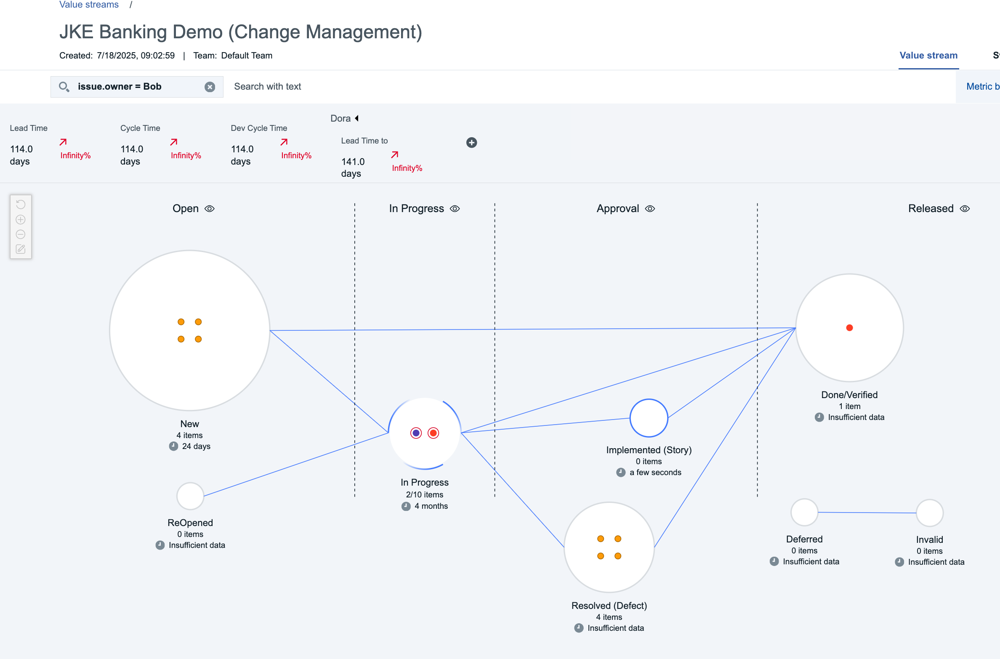 |
| **HINT:** | DQL provides the user with code assist to help build more complex queries to return the desired data. |   |

Congratulations on successfully completing this section of the demonstration. 

### 1.2 Working with DevOps Velocity's KPIs and Metrics
DevOps Velocity provides numerous Key Performance Indicators (KPIs) out of the box which can be added and displayed at the top of the Value Stream including "Lead time to Change", "Lead Time", "Cycle Time" and "Dev Cycle Time". All of which may be modified but are used to calculate the elapse time from a start stage to an end stage. In addition, these KPIs show trending. Is pipeline performance improving or not and by what percentage.

In additional to the lead time and cycle time KPIs, other KPIS are available - Average Load, Throughput, Distribution etc... are also available to help measure team productivity and whether process improvement is necessary.

This section of the demonstration will share details on the many of the KPIs readily available in DevOps Velocity.

| **Step** | 
**Details**
  | **Additional Information** |
|:-------------:|:------------- |:------------- |
| 1 |  Working in the "JKE Banking Demo (Change Management)" value stream, locate the Lead Time and Cycle Time KPis. | 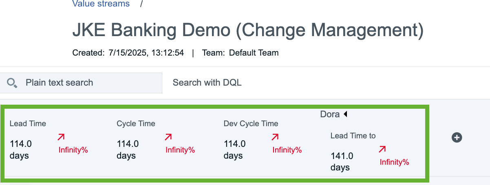 |
| 2 | These KPIs has been configured to calculate times and monitor change for all work items as work passes through the pipeline stages:    <strong>Lead Time:</strong> Start - In progress / End - Done/Verified   <strong>Cycle Time:</strong> Start - In Progress / End - Done/Verified   <strong>Dev Cycle Time:</strong> Start - In Progress / End - Implemented (Story)   <strong>Lead Time to Change:</strong> Start - New / End - Done/Verified   |   |
| 3 | Click on the "3 dots" beside the Dev Cycle Time KPI. | 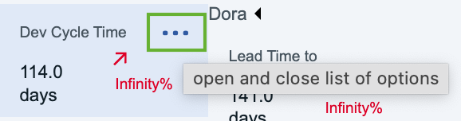 |
| 4 | Click on the "Start Stage" listbox and confirm that the "In Progress" stage is set. | 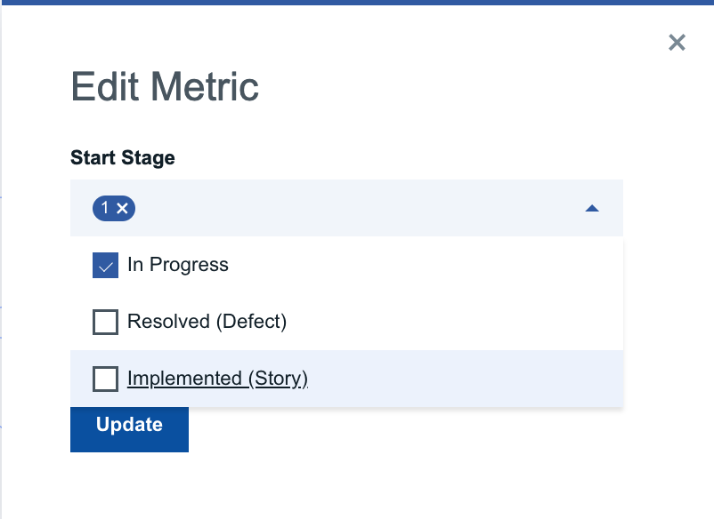 |
| 5 | Click on the "End Stage" listbox and update selecting both the "Implemented (Story)" and "Resolved (Defect)" stages. Click "Update" when complete. | 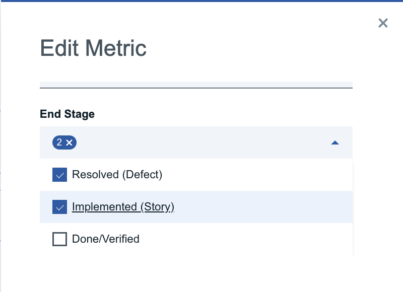 | 
| **NOTE:** | Changing the Start and End stages for any one of the Lead Time and/or Cycle Time KPIs forces a re-calculation of the metrics in DevOps Velocity. In the case where there are multiple Start and/or End Stages, DevOps Velocity calculates an average time considering all work items which have moved from the selected start stage(s) to the selected end stage(s). |  |
| **HINT:** | Due to the older ELM data being synchronized with DevOps Velocity, the trending feauture is showing infinity. However, as work items change state and new data is added, the trending KPIs will provide very important data. Red arrows indicate that the delivery pipeline is getting slower and Velocity will calculate and display a percentage of how much of a increase in time. Green arrows indicate positive change and again, Velocity will display a percentage indicating the level of improvement | 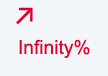 | 
| 6 | Click on the "+" icon (to the right of the Lead Time and Cycle Time KPIs) to add some additional metrics to the metrics bar. | 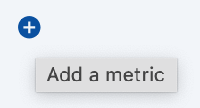 |
| 7 | From the list provided, select "Average Load", "Throughput", and "Distribution" as 3 examples. | 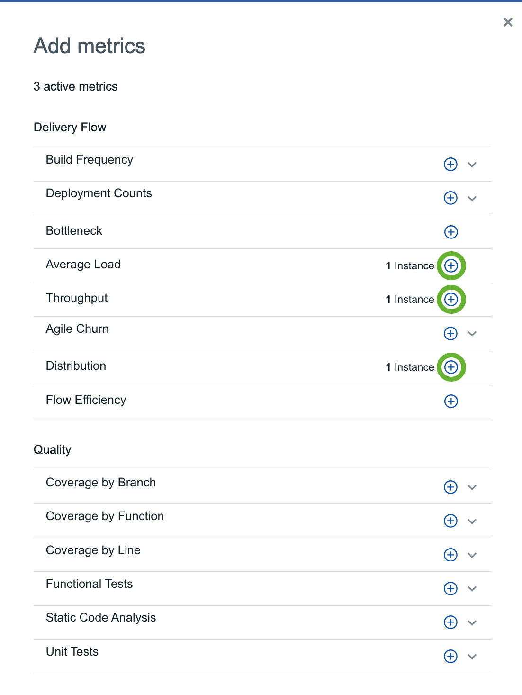 |
| 8 | The metrics bar update should be display the additions similar to the following:   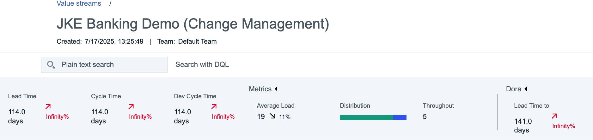     <strong>Metrics Definitions:</strong>    <strong>Average Load</strong>  - The number of work items active or waiting in a value stream at a given time. Load measures utilization capabilities of value streams related to productivity in the process flow. "Active" refers to the stages from the lead-time start until the lead-time end.   <strong>Throughput</strong> - The rate of work items completed during a period of time. Improving throughput can result in better responsiveness to customer requirements and may yield lead time reductions for value streams.   <strong>Distribution</strong> - The proportion of different types of work items over time. This provides teams visibility into the type of work being completed (features, defects, tasks, and so forth.)    For more information about DevOps Velocity Metrics, visit [Velocity's product documentation page](https://www.ibm.com/docs/en/devops-velocity/5.1.0?topic=metrics-displaying#vsm_metricsBar). |   |
| **NOTE:** | Feel free to explore other metrics, however, some may not display data points due to a lack of data in Velocity's repository. |   |

Congratulations on successfully completing this section of the demonstration.

### 1.3 DevOps Velocity and the Swimlane View

DevOps Velocity's swimlane view display the same work items as shown on the value stream view but categorized by owner, by priority, by type, by release, and by sprint making this view a very powerful view in reviewing, managing, and updating team work during meetings. In this part of the demo, you will experience how the owner swim lane view can be used when communicating as a team. The Priority and Type swimlanes assist in determining if there is the right distribution of in flight work. And the Sprint/Release swimlanes allow the team to quickly see if work is progressing as planned or not.

| **Step** | 
**Details**
  | **Additional Information** |
|:-------------:|:------------- |:------------- |
| 1 |  Continuing to work in the "JKE Banking Demo (Change Management)" value stream, click on the "Swimlane" link located on the sub navigation bar (top RHS of browser window). | 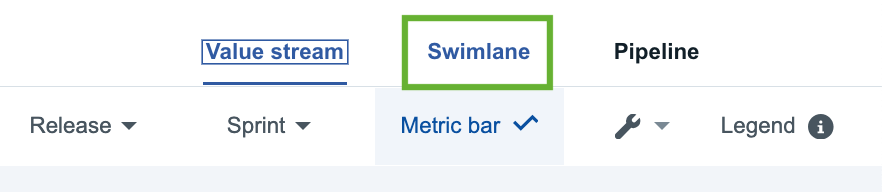 |
| 2 | Click on the "Sprint" swimlane (LHS of browser window). | 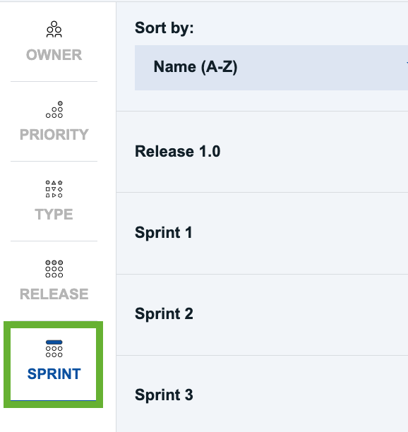 |
| 3 | Notice how easily you can see the status of each work item in each phase and stage of the value stream helping teams determine if they will deliver work on time and as per plan. | 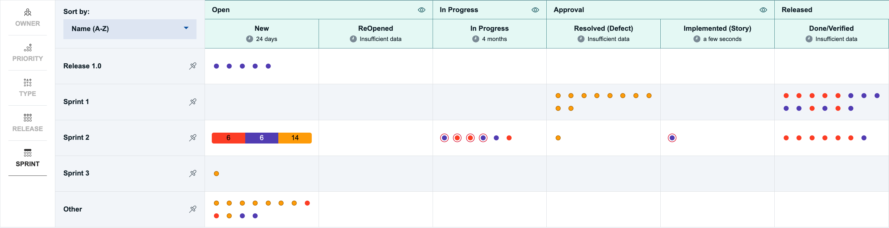 |
| 4 | Click on the "Release", "Type", and "Priority" swimlanes to observe how DevOps Velocity visualizes the work items for each swimlane category similar to what was seen in the Sprint swimlane view. |  |
| **Example Scenario** | Imagine you are the Team Lead for the JKE Banking product team and have assembled the team to review current assignments with the intent of getting status updates on the assigned work.   How could Velocity assist in conducting this meeting? |  |
| 5 | Click on the "Owner" swimlane view and focussing on the "In Progress" stage see all the work items currently being worked on. | 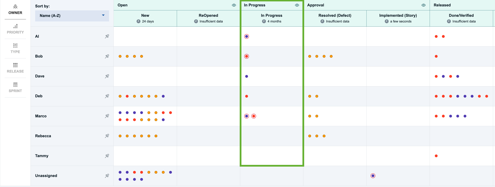 |
| 6 | Notice that Marco has two active work items violating the WIP best practice of one work item at a time and both work items are exceeding the average wait time for In Progress stage. | 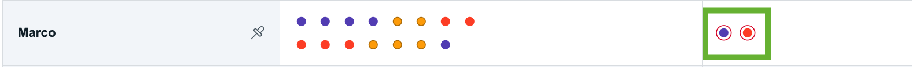 |
| **NOTE:** | At this point, there would be a conversation asking Marco about the two open work items runnning long. And through that discussion Marco shared that time was being wasted having to ask Bob for updates on the associated Task. And he was also having to provide status updates to Al, owner of the story, for the task assigned to him. |  |
| 7 | Click on the "Story" work item to open the work item card and click on the "work item title" on the card. | 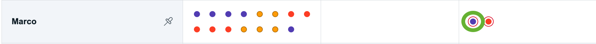  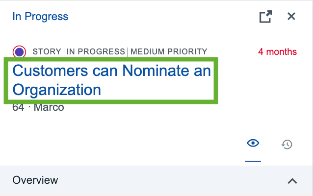|
| **HINT:** | If prompted to authenticate with the ELM system, use the following:  User ID: sysadmin Password: passw0rd (passw-zero-rd)  |  |
| 8 | Working in EWM, click on the work item's Links tab. | 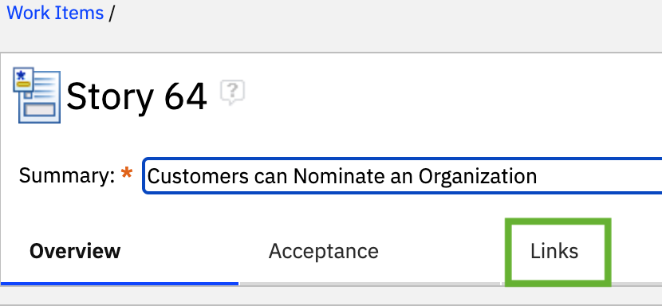 |
| 9 | Hover the mouse pointer over the child work item to display the Task overview information. | 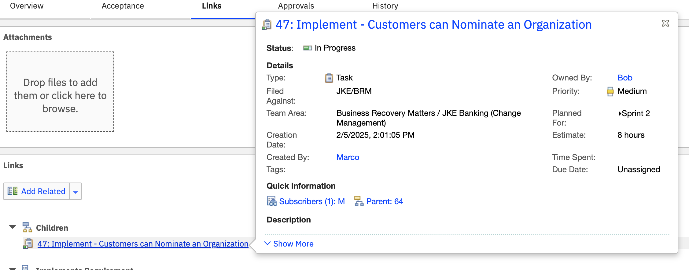 |
| 10 | Notice that "Bob" is the owner of the Task which is associated to the parent Story owned by "Marco".   For the purpose of this demo scenario, let's assume that JKE Banking Engineering has a rule that the individual who owns the story should also own the tasks to implement the story. The ownership of work items is clearly a violation of this rule. | 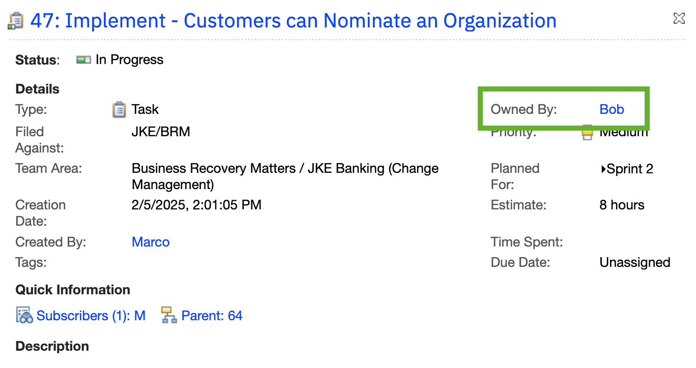 |
| 11 | Returning to the work item Overview tab, change the owner of the Story to "Bob", save the change, and close the EWM browser tab. |  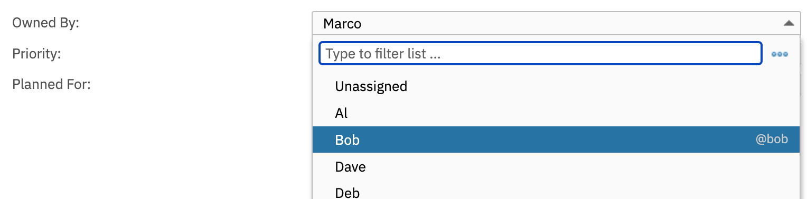 |
| 12 | Click on the Task owned by Marco in the In Progress stage and again open the work item card clicking the card title to open the work item in EWM. | 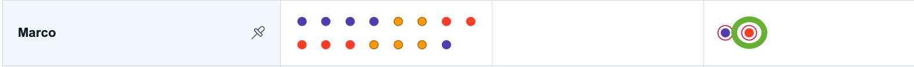 |
| 13 | Click on the Task work item's link tab and hover over the parent work item to view the Story overview. | 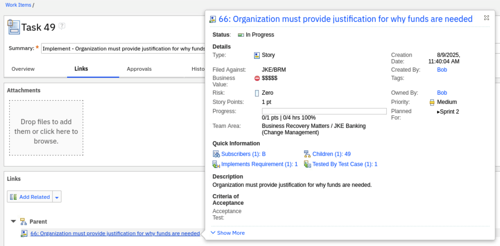 |
| 14 | Notice that the Story is owned by "Al" but the Task to implement the story is owned by "Marco". |   |
| 15 | Click on the Parent work item link, change the owner to be Marco, save the changes and close the EWM browser tab. | 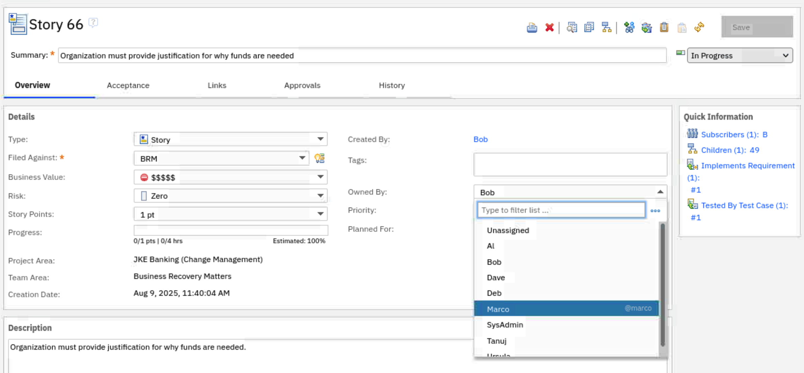 |
| 16 | Notice how the work items being visualized are reflecting the changes made in EWM. |   |
| **NOTE:** | Through the integration between DevOps Velocity and ELM, Velocity will synchronize work item changes every 5 minutes. For the purposes of this demo and to avoid wasting time waiting for the EWM changes to be synchronized with Velocity, perform the following steps. |   |
| | Click on the Settings icon, top RHS of DevOps Velocity browser tab. | 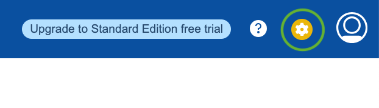 |
| | On the Settings page, select Integrations from the LH navigation bar. | 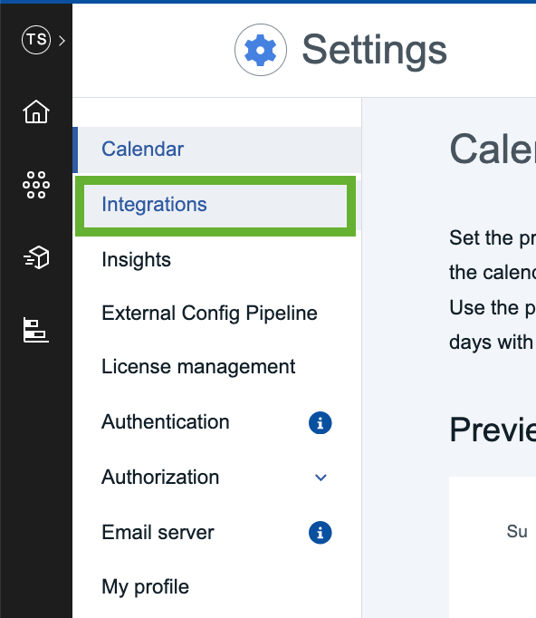 |
| | Click the Disable/Enable control for the EWM(JKEBanking) integration toggling from off to back on.   This toggling action will force Velocity to re-sync with EWM and retrieve the changes. | 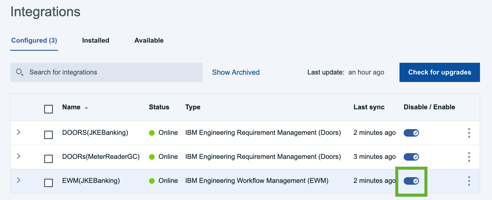 |
| | Return to the Owner Swimlane view of the JKE Banking Demo (Change Management) value stream. |   |
| 17 | Perform a plain text search using the phrase "organizations can apply". | 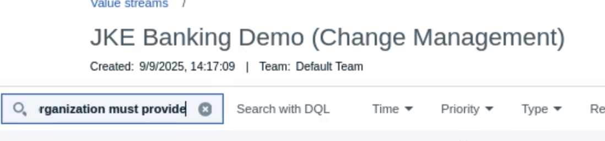 |
| 18 | Notice that after the changes in EWM, both the story and the task to implemented that story are owned by Marco. | 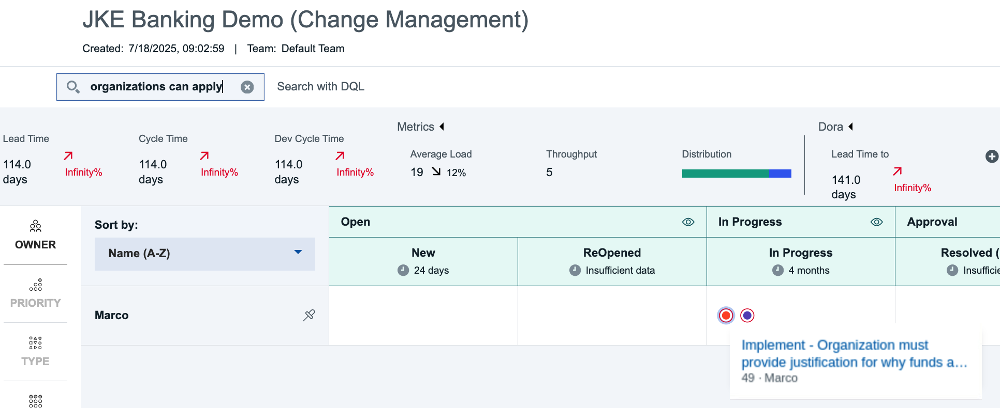 |

Very quickly and with the help of DevOps Velocity, the Team Lead was able to review work item distribution and take corrective action to make both Bob and Marco more efficient. As they now own the story and the children tasks to implement that story instead of working on tasks for others stories, this has reduced the time spent having to communicate on progress with others.

**Congratulations on successfully completing "Business Scenario 1: Visualize and Optimize the flow of work to improve team productivity" of the demonstration.**

Hopefully you have gained an appreciation for the many DevOps Velocity's features which can help teams identify slow points in the delivery pipeline and how Velocity presents an abundance of information to assist in determining where corrective action is needed in order to optimize the flow of work through the software delivery pipeline.

[Return to Top of Demonstration Page](#integrating-devops-velocity-with-elm-to-achieve-business-outcomes)
 

## Business Scenario 2: Eliminate guess work and use data to make better investment decisions for process improvement

### 2.1 DevOps Velocity's "Digital Chain of Custody"

The activity performed against every work item visualized in DevOps Velocity is tracked from inception to completion. This assist the team when asked to verify that specific work items have followed the development process by auditors. What could be a large effort checking the different solutions used in the delivery pipeline, Velocity makes responding to the request simple. In fact, Auditors equipped with access to Velocity could check for themselves without interrupting the team. 

| **Step** | 
**Details**
  | **Additional Information** |
|:-------------:|:------------- |:------------- |
| 1 | Working in the JKE Banking Demo (Change Management) value stream, perform a plain text search using the string value "78". | 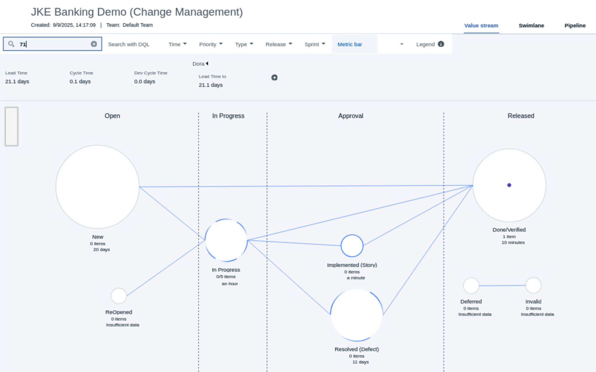 |
| 2 | Click on the one work item displayed in the Done/Verified stage of the Release phase. |   |
| 3 | On the work item card displayed, scroll down to see a complete audit trail of activities performed. Including who performed the action and when the action was performed. | 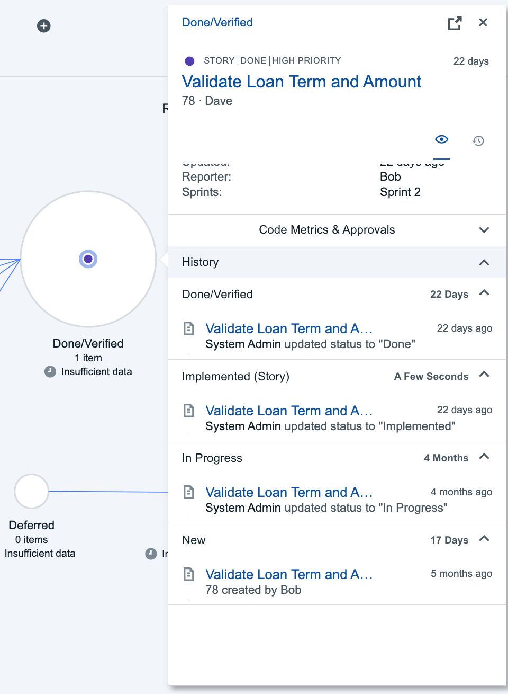 |
| 4 | Close the work item card by click the X top right. |   |

Congratulations on successfully completing this section of the demonstration.

### 2.2 Adding DevOps Velocity's Bottleneck Detection capability

DevOps Velocity's Bottleneck Detection capability automatically executes AI algorithms against the work item's history, visualized in the value stream, checking for 3 specific types of bottlencks and identifying a specific stage which requires attention. Those bottleneck types are:
1. Dominant stage bottleneck
2. Batching bottleneck
3. Inflow/outflow asymmetry bottleneck

A **dominant stage bottleneck** occurs when one stage in a value stream has a time-in-stage value greater than or equal to the sum of the time-in-stages of all other stages in that value stream. The dominant stage detection algorithm detects this condition in a value stream and uses the severity value of the dominant stage to non-dominant stages time-in-stages to assess the severity. Each value stream will have only one dominant stage bottleneck detection at a given time.

A **batching bottleneck** occurs when work items exit a given stage in short time intervals separated by large intervals with no associated activity. This algorithm detects batching by calculating stage exit event densities and comparing peak densities to off-peak densities. The severity of the batching bottleneck corresponds to the peak to off-peak density ratio. A value stream may contain multiple stages with batching bottlenecks at a given time.

An **inflow/outflow asymmetry bottleneck** occurs when there is an unusually large difference of work items flowing into and out of a stage on a given day. This algorithms monitors 24 hour periods where the net work item flow for a stage is greater than two standard deviations from the mean net flow, and total stage flow is in the top five percent of the historical stage flow records. The severity of the bottleneck is assessed by the amount value above the net flow detection threshold. A value stream may have multiple stages with inflow/outflow asymmetry bottlenecks at a given time.

In this section, you will enable DevOps Velocity's Bottleneck Detection capability and add it to the JKE Banking Demo (Change Management) value stream.

| **Step** | 
**Details**
  | **Additional Information** |
|:-------------:|:------------- |:------------- |
| 1 | Navigate to DevOps Velocity's Settings page click the gear icon (top right of browser window) |  |
| 2 | Click on the Integrations view. |  |
| 3 | Click the Installed tab on the Integrations page. | 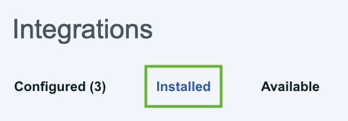 |
| 4 | Search for the Bottleneck Detection plugin and click "Add Integration". | 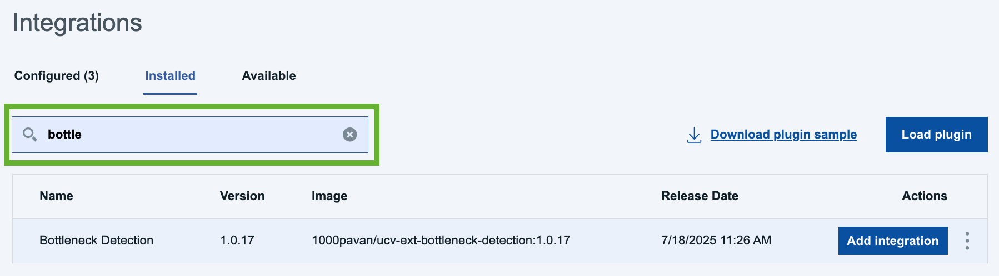 |
| 5 |  Provide a meaningful name (e.g. Bottleneck Detection) to identify the plugin in the future and click Add.  | 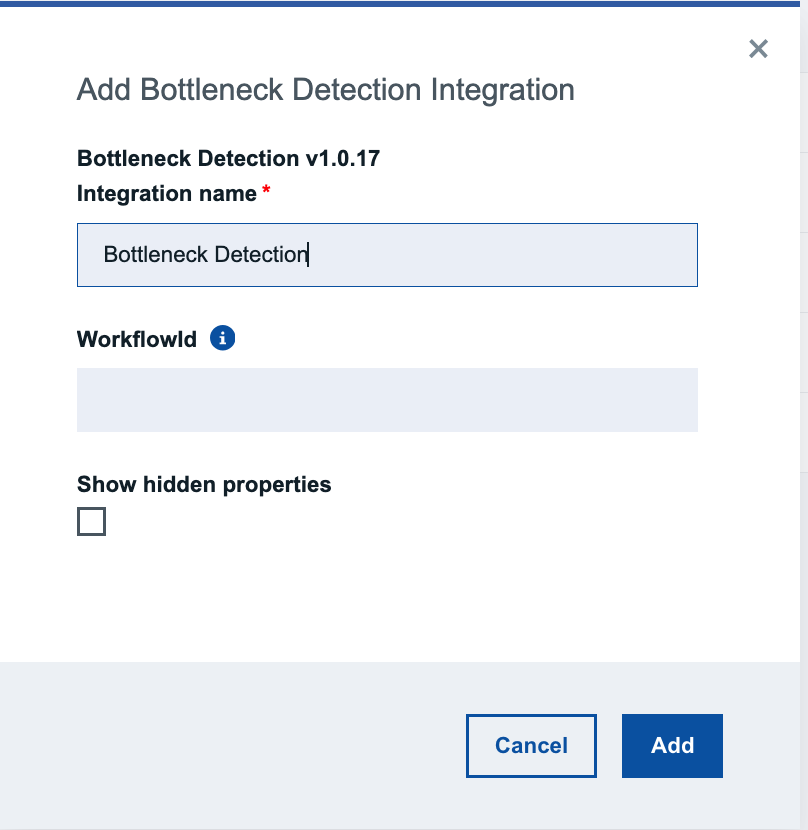 |
| 6 | Return to the JKE Banking Demo (Change Management) value stream. |   |
| 7 | Click the + to add the Bottleneck Detection metric to the metrics bar. | 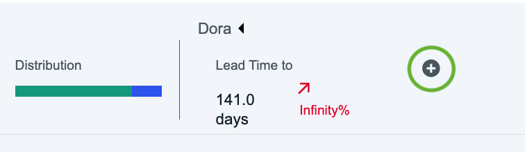 |
| 8 | Select Bottleneck from the list of metrics displayed. |   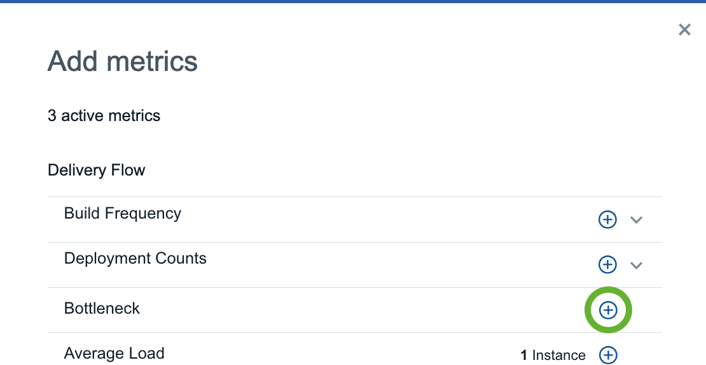 |
| 9 | Notice that the Bottleneck Detection algorithm has run and that DevOps Velocity has identified that "In Progress" is the slowest point in the delivery pipeline. | 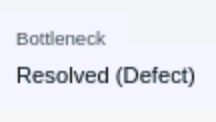 | 
| 9 | Hover the mouse pointer of the Bottleneck metric to get more detail on the type of Bottleneck. | 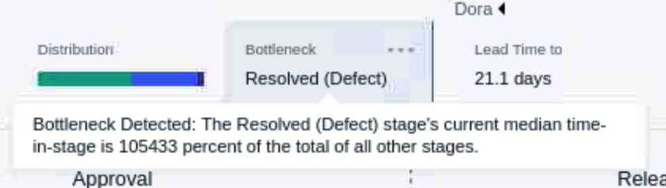 |

Congratulations on successfully completing this section of the demonstration.

### 2.3 Working with DevOps Velocity's DashBoards and Charts

Where the value stream visualize and display data over the past 30 days, Insights Dashboards display data from a little as 24 hours to all time depending on the filter settings. Having the ability to view delivery pipeline data across a longer time period, teams can use charts to understand change over time to understand if productivity is improving or not.

| **Step** | 
**Details**
  | **Additional Information** |
|:-------------:|:------------- |:------------- |
| 1 | Continuing to work in DevOps Velocity, click on the Insights icon located on the left hand navigation bar.  | 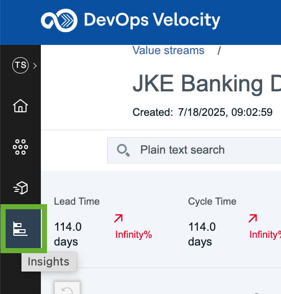 |
| 2 | Click on the JKE Banking card to open the dashboard. |  |
| **NOTE:** | This dashboard has been configured for the purposes of this demonstration. Know that, dashboards can be configured to display data meeting the needs of your stakeholders. |    |
| 3 | Take a moment to explore the data present. Explore how the data being displayed in the charts changes by modifying the Time and Group by filter settings. | 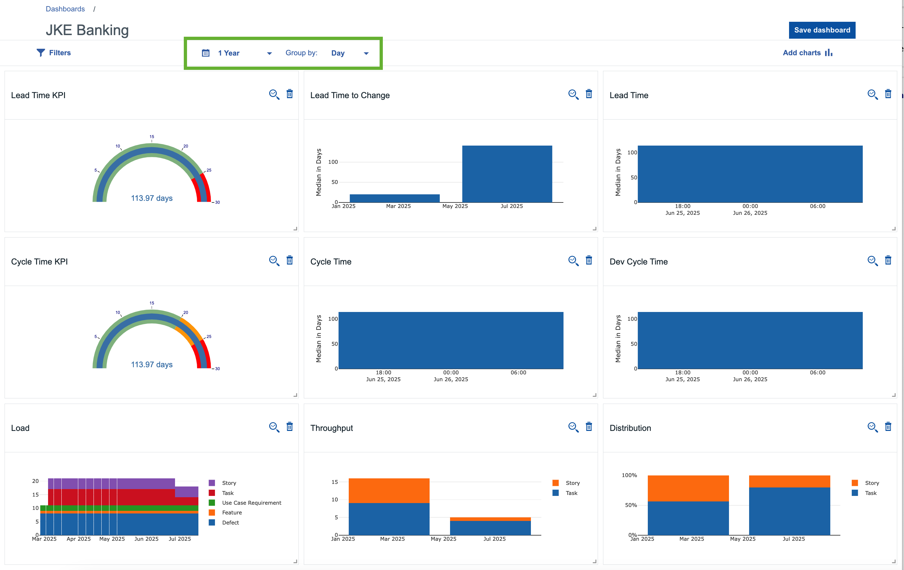 |
| 4 | Click the magnifying glass icon on the "Lead Time to Change" chart drilling into the chart details. | 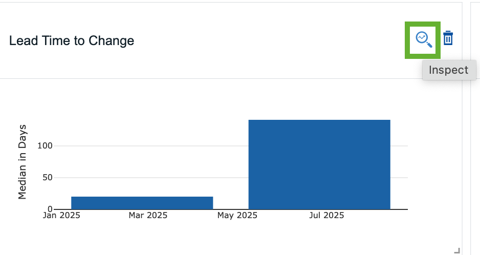 |
| 5 | Scroll down in the chart details and see information for all the work items which have been completed including:    - Work item ID   - Type    - Name   - Owner   - Lead Time to Change duration  | 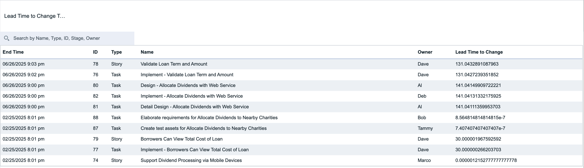 |
| **NOTE:** | While the chart image presents overview of what has transpired and makes it easy to identify trends, the details view provides the team with more information related to individual work items included in the chart image. |   |
| 6 | Click <- Back to charts to return to the dashboard view. | 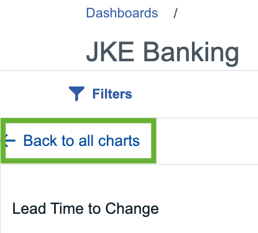 |
| 7 | The Lead Time and Cycle Time KPI charts use Insight rules set up for this demonstration which can display Technical Objectives. Insight rules allow the team to set goals related to productivity and instantly see progress in achieving those goals.    For the Lead Cycle KPI, an acceptable amount of time for a work item to go from inception to implementation is 25 days. And the Cycle Time shows delivery goal of 20 days from the time work starts until it is declared Done and in Production. | 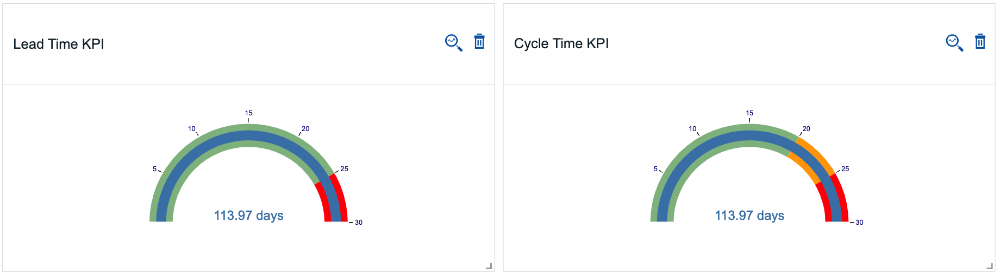 |

**Congratulations on successfully completing "Business Scenario 2: Eliminate guess work and use data to make better investment decisions for process improvement" of the demonstration.**

[Return to Top of Demonstration Page](#integrating-devops-velocity-with-elm-to-achieve-business-outcomes)

| Software Installed for Demonstration Steps | Software Version |
|:---- |:----:|
| DevOps Velocity | v5.1.7 |
| Engineering Lifecycle Management | v7.1