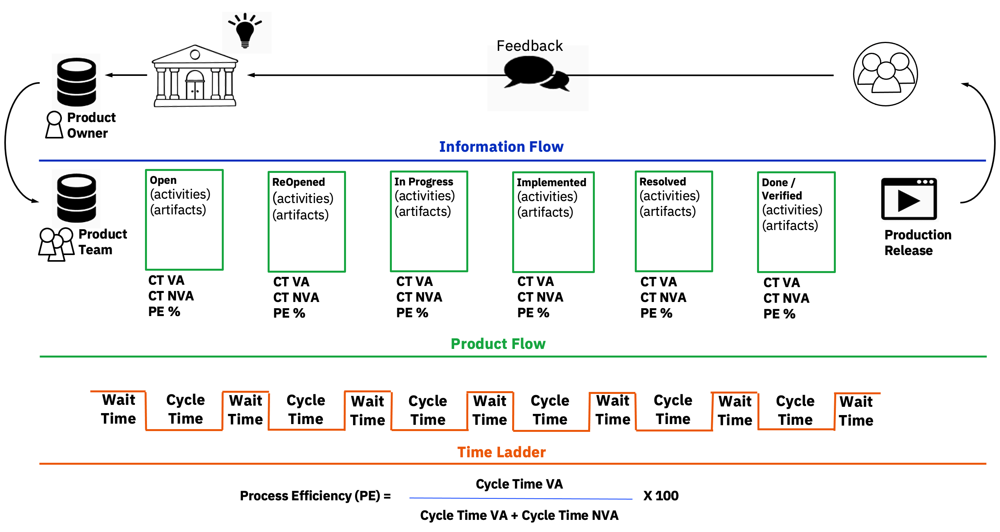
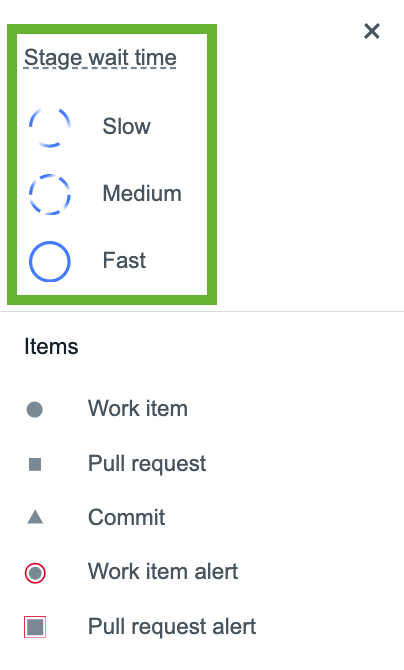

# Integrating DevOps Velocity with ELM to achieve Business Outcomes

## Business Scenarios covered by this demonstration:
### * [Visualize and Optimize the flow of work to improve team productivity](#business-scenario-1-visualize-and-optimize-the-flow-of-work-to-improve-team-productivity)
### * [Eliminate guess work and use data to make better investment decision for process improvement](#business-scenario-2-eliminate-guess-work-and-use-data-to-make-better-investment-decisions-for-process-improvement)

## About the Demonstration

For this demonstration, DevOps Velocity has already been integrated with ELM and value streams created visualizing the ELM data as stories, bugs, tasks, features and requirements. This allows you to focus on the features of the integrated solution and how DevOps Velocity and ELM can work together.

The following table shares information on which ELM projects have been visualized in DevOps Velocity:

| **ELM Project** | **Velocity Value Stream**  | **Additional Information** |
|:------------- |:------------- |:------------- |
|JKE Banking (Change Management) | JKE Banking Demo (Change Management) | The JKE Banking project was created in ELM using the Money that Matters sample data which includes work items in EWM and requirements added to ERM. A DevOps Velocity plugin has configured allowing the EWM data to be sync'd with Velocity and displayed in the value stream. | 
| JKE Banking (Requirements Management) | JKE Banking Demo (Requirements Management) | The JKE Banking Demo (Requirements Management) value stream is visualizing requirements synchronized by integrating DevOps Velocity with JKE Banking (Requirements Management) project.
| Meter Reader GC | Meter Reader Demo GC | This value stream is visualizing requirements synchronized with DevOPs Velocity from a ERM project which has Global Configuration enabled providing more robust requirements management capabilities enabling the use of DOORs NG components, streams and baselines. |

**NOTE:** The images provided in the steps below may not exactly match what is seen in the DevOps Velocity browser window. Understand that they are provided as a reference as you work through the demo steps.

## Understanding the Business Challenge addressed in this demonstration

Many DevOps organizations use Dora metrics or Flow metrics to measure the efficiency of their software delivery pipeline. While Flow metrics focus on the stream of work items and the efficiency of processes, Dora metrics provide insights into the effectiveness of software development and delivery practices. However, regardless of which KPIs are adopted, both provide a high level measure of the end to end software delivery process.

**DORA Metrics**

1. Deployment Frequency - How often do production releases occur?
2. Lead Time to Change - What is the length of time it takes for code changes to be made available in production?
3. Change Failure Rate - What is the frequency of deployments which cause an issue in production?
4. Mean Time to Recovery - What is the length of time it takes to recover from the production issue?

**Flow Metrics**

1. Flow Time: Is time-to-market getting shorter?
2. Flow Velocity: Is value delivery accelerating? 
3. Flow Efficiency: Is upstream work holding up delivery?
4. Flow Load: Is demand vs capacity being balanced?
5. Flow Distribution: Are we investing in both value generation and protection?

Now it is a well know fact that any process is only as fast as its slowest point (Theory of Constraints). And all processes have at least one slow point. The "trick" is to find the bottleneck(s), take action to improve, and measure the outcome (better - same - worse) to understand if the desired result was achieved.

Using these high level metrics and armed with a desire to improve, the next typical step would be for the organization to execute a Value Stream Mapping exercise assembling a team of people to share their experience and opinions on how long each stage of the end to end process takes and recording this information on a value stream map - value add time (VA), non-value add time (NVA), process efficiency (PE) for each individual stage in their process. This can be a very expensive and laboreous process where the outcome is only valid until some improvement action is implemented. Because, once the process improvement is implemented, the bottleneck has probably moved to another location in the delivery pipeline.

The alternative to Value Stream Mapping is Value Stream Management. A Value Stream Management solution, like DevOps Velocity, is continuously ingesting data from the various tools used in the software delivery pipeline and presenting that data in a holistic view providing insight, in almost real time, on not only how efficient the software delivery pipeline is but where in the pipeline opportunities for improvement exist. Value Stream Management is a much more scientific approach eliminating the guess work and helping teams make better decisions on where to improve based on data instead of opinion.

DevOps Velocity helps organizations by visualizing delivery pipeline data in a holistic dashboard allowing teams to make accurate decisions on where to invest in process improvement to optimize flow and achieve their desired business outcomes.

## Introducing DevOps Velocity

DevOps Velocity is a multi-container application installed in a Kubernetes container management system. 
  

The DevOps Velocity value stream’s view provides a strategic window into your life-cycle workflow while simultaneously enabling you to drill-down and monitor individual elements with the intent of optimizing pipeline flow. These elements typically represent work items/issues, commits, pull requests, builds, deployments, and tests that are collected from many tools making up your delivery pipeline and integrated into Velocity via plugins. Individual elements are represented graphically by small circles, squares, or triangles, depending on the type, providing information from logically related tools, such as issues managed in an ALM solution linked to one’s source control management (SCM) system. How elements are visualized in a DevOps Velocity value stream can be simple to very complex. You are only limited by your knowledge of how to architect a value stream.

The pipeline capability enables organizations to drive releases by using application-focused methods. Add applications to logical environments and let DevOps Velocity generate basic release plans required to deploy the applications. Use quality gates to implement an enhanced level of automated governance helping organizations reduce business risk as software change moves through the delivery pipeline to the production environment.

DevOps Velocity’s enterprise-scale release management capabilities supports both cloud-native and on-premises deployment. Use DevOps Velocity to move releases through all of your development life-cycle environments including development, testing, and production. Create a predictable schedule of releases for your software applications. Share release statuses with all stakeholders so that they know the schedules, the key milestones, current status, and issues that may delay releases.

The Insights view helps organizations to assess the efficiency of product teams and the speed at which they are able to deliver value to the end users. Teams can measure every aspect of the development lifecycle with the supplied charts. Teams can create their own charts with metric definitions and upload custom data to DevOps Velocity using the Application programming interface (API) endpoints. Since data sources also encompass plug-ins and API calls, project data can come from virtually anywhere, including planning and development tools, testing and building applications, and deployment solutions.

In this demonstration, you will focus on the Value Stream and Insights views.

For more information about DevOps Velocity, visit [Velocity's product documentation page](https://www.ibm.com/docs/en/devops-velocity/5.1.0?topic=high-level-overview).
 

## Business Scenario 1: Visualize and Optimize the flow of work to improve team productivity.

### 1.1 DevOps Velocity and the value stream data

The value stream for this demo is architected to align with ELM's workflow including the phases and stages making up the software delivery pipeline. And through the integration between DevOps Velocity and ELM, DevOps Velocity tracks the number of work items and average time a work item spends in each one of the stages defined in the ELM workflow. It is DevOps Velocity's ability to present this type of information in a single control plane which allows teams to focus on where improvement is required instead of wasting time trying to determine which stage is the software delivery pipeline is the slowest point.

| **Step** | **Details**  | **Additional Information** |
|:-------------:|:------------- |:------------- |
| 1 | Launch the Chrome browser from the Windows toolbar and click on the DevOps Velocity bookmark  |  |
| 2 | Authenticate with Velocity using "admin" for both the user id and password.  |  |
| 3 | Click the Value Stream icon on the LH navigation bar in Velocity. |  |
| 4 | Select the JKE Banking Demo (Change Management) value stream from the list of available value streams. |  |
| 5 | Click on "Legend link located on the sub navigation bar (top RHS of browser window). |  |
| 6 | Notice the outlines around the In Progress and Implemented stages.   Referring to the Legend pop up window, the In Progress is showing as slow and would be a location to investigate further. |  |
| 7 | Focusing on the In Progress stage and looking below the stage circle, one can see that on average a work item stays in the In Progress stage for 4 months. |  |
| 8 | Above the average time a work item is a Work in Progress (WIP) limit. Notice that the WIP limit is set at 5 work items where an alert has been triggered because there are 6 work items in the In Progress stage. |  |
| **NOTE:** | WIP measures the number of active work items which are still a work in progress. The rule of thumb for setting a WIP limit is to use the total number of people who execute in a particular pipeline stage + 1. When the WIP limit has been exceeded (indicated by the red font color), it typically means that people are wasting time switching context as they shift work between one work item and another. And it is well documented that the average time wasted as a person shifts from working on one thing to another is approximately 45 minutes. Teams are more efficient when they focus on one work item at a time instead of juggling multiple assignements simultaneously. |   |
| 9 | Click on one of the "DOTS" in the In Progress stage which has a red circle around it. A red cirlce indicates that a work item has been in a stage longer than the average time. In this case, longer than 4 months. |  |
| 10 | The work item card provides more detail about the specific work item, including and an audit trail, to assist in getting that work item moving forward. DevOps Velocity's State alert helps keep work items that are taking too long top of mind. Close the work item by clicking the X top right of the work item card. |  |
| **HINT:** | Returning to the Legend, notice that DevOps Velocity can also track Commits and Pull Requests as well as Work Items - story, defect or task. |  |
| 11 | Close the Legend pop up window by clicking the X in the Legend pop up window. |  |
| 12 | Continuing to work in the JKE Value Stream, locate the filters on the sub navigation bar in the value stream view. |     |
| 13 | Click on the following filters and select the filtering options listed below:   Time: 60 days   Type: Story   Sprint: Sprint 2 |  |
| 14 | Notice how only the work items matching the filter settings are displayed. This filtering capability helps teams focus on specific work items matching a specific criteria. |  |
| 15 | Clear the filters click the X beside the filter name. |  |
| 16 | Working with the "View value stream data by" drop down list box, select the different options available to observe how the work items can be viewed in different ways. Notice how the Value Stream legend changes depending on the view by optional selected. |  |
| 17 | Another means of filtering is to use DevOps Velocity's search capabilities. Locate the plain text search textbox, enter the value "Allocate Dividends", and press the return key. |  |
| 18 | Notice that only the work items matching that search criteria is displayed. Those work items that have "Dividend Allocations" in the title. |  |
| 19 | Click on the Search with DQL (DevOps Query Language) |  |
| 20 | Enter issue.owner = Bob in the text box |  |
| 21 | Observe how DQL enables the user to return a collection of work items meeting the search criteria. In this case, Velocity has displayes ALL work items currently owned by Bob. |  |
| **HINT:** | DQL provides the user with code assist to help build more complex queries to return the desired data. |   |

Congratulations on successfully completing this section of the demonstration.

### 1.2 Working with DevOps Velocity's KPIs and Metrics
DevOps Velocity provides numerous Key Performance Indicators (KPIs) out of the box which can be added and displayed at the top of the Value Stream. And depending on how the value stream has been architected, teams can display KPIs for Lead time to Change, Lead Time, Cycle Time and Dev Cycle Time. Each of which may be modified but in general are calculating the elapse time from a start stage to an end stage. In addition, the KPIs show trending. Is pipeline performance improving or not and by what percentage.

| **Step** | **Details**  | **Additional Information** |
|:-------------:|:------------- |:------------- |
| 1 |   |  |

### 1.3 DevOps Velocity and the Swimlane View

| **Step** | **Details**  | **Additional Information** |
|:-------------:|:------------- |:------------- |
| 1 |   |  |

Congratulations on successfully completing this section of the demonstration.

[Return to Top of Demonstration Page](#integrating-devops-velocity-with-elm-to-achieve-business-outcomes)
 

## Business Scenario 2: Eliminate guess work and use data to make better investment decisions for process improvement

### 2.1 DevOps Velocity's "Digital Chain of Custody"

| **Step** | **Details**  | **Additional Information** |
|:-------------:|:------------- |:------------- |
| 1 |   |  |

### 2.2 Adding DevOps Velocity's Bottleneck Detection capability

| **Step** | **Details**  | **Additional Information** |
|:-------------:|:------------- |:------------- |
| 1 |   |  |

### 2.3 Working with DevOps Velocity's DashBoards and Charts

| **Step** | **Details**  | **Additional Information** |
|:-------------:|:------------- |:------------- |
| 1 |   |  |

 

[Return to Top of Demonstration Page](#integrating-devops-velocity-with-elm-to-achieve-business-outcomes)