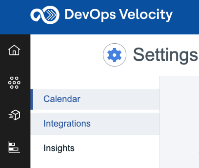
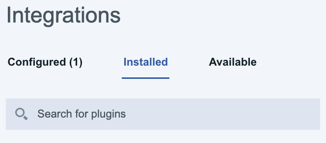
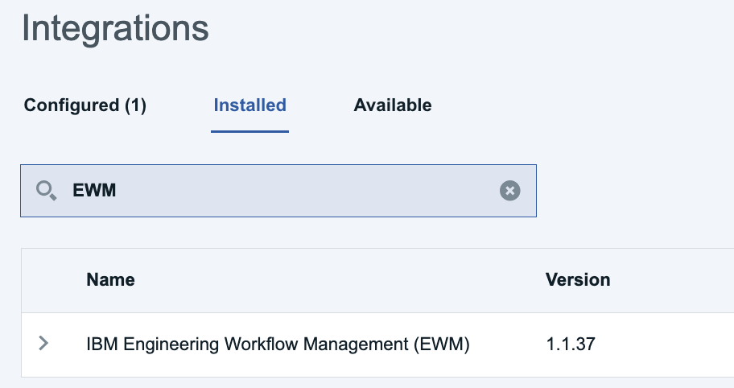
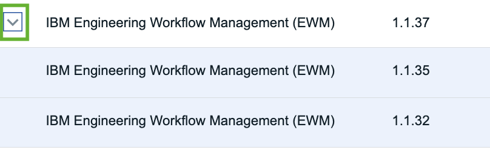
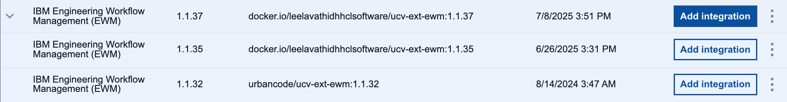
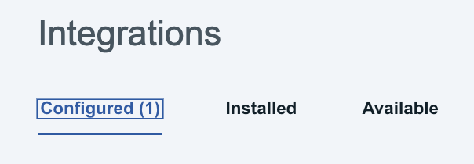
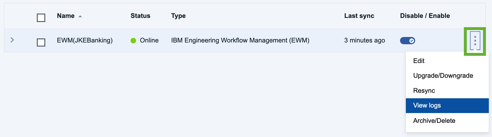
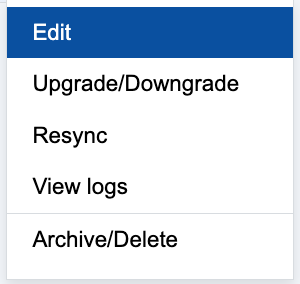

# Configuring the integration between DevOps Velocity and ELM

### Topics covered in this Enablement exercise
1. [What is a Velocity Plugin](#what-is-a-velocity-plugin) 
2. [Configuring the plugin to integrate DevOps Velocity and EWM](#configuring-the-plugin-to-integrate-devops-velocity-and-ewm)
3. [Preparing RM projects (reg mgmt and global configurations) for integration with Velocity](#preparing-rm-projects-reg-mgmt-and-global-configurations-for-integration-with-velocity)
4. [Configuring the plugin to integrate DevOps Velocity with ERM (DOORs NG req mgmt project)](#configuring-the-plugin-to-integrate-devops-velocity-with-erm-doors-ng-req-mgt-project)
5. [Configuring the plugin to integrate DevOps Velocity with ERM (DOORs NG global configuration)](#configuring-the-plugin-to-integrate-devops-velocity-with-erm-doors-ng-global-configuration)
6. [Creating a Value Stream in DevOps Velocity](#creating-a-value-stream-in-devops-velocity)
7. [Architecting the value stream aligned to the ELM Artifact Workflow](#architecting-the-value-stream-aligned-to-the-elm-artifact-workflow)
8. [Understanding DevOps Velocity's value stream map file](#understanding-devops-velocitys-value-stream-map-file)

### What is a Velocity Plugin

Included as part of a Velocity installation are plugins which allow the Velocity Administrator to create connections between delivery pipeline applications and synchronize data between Velocity and the target application source (ELM, Jira, GitHub, DevOps Control, etc). Each plugin defines an expected record type and communication method. Communication can be uni-directional or bi-directional. To use a plug-in, you must configure an integration. There are multiple ways to configure an integration:
- Create an integration definition on the Plugins tab of the Integrations page.
- Install the plug-in and then create an integration definition.
- Add an integration definition to a value stream JSON file.
- Configure a deployment plan task for one of the native integration types.

In total there are over 45 plugins available.

Once configured and as per that plugin’s synchronization timing, Velocity starts a plugin container image, makes the connection with the target application, and retrieves all data changes from the last sync time. NOTE: that sync time duration will vary depending on the amount of data being added to Velocity’s MongoDB repository.

 

[Return to List of Topics](#topics-covered-in-this-enablement-exercise)
 

### Configuring the plugin to integrate DevOps Velocity and EWM
 

| **Step** | **Details**  | **Additional Information** |
| ------------- | ------------- | ------------- |
| 1 | To access the Velocity plugin interface, open Velocity in a browser and log in.   (uid: admin / pwd: admin) |   |
| 2 | Click on the settings icon. (Top RHS browser window) |  |
| 3 | Select Integrations from the LHS navigation bar. |  |
| 4 | Click on the Installed tab and review the many plugins already available. |  |
| **NOTE:** | While this exercise does not cover all topics related to plugins, know that administrator users can install additional plugins from the "Available" tab or upload custom plugins using the "Load Plugin" feature. |  |
| 5 | In the search control, enter “EWM”. |  |
| 6 | Click the twisty icon for the EWM plugin and note that there are multiple versions of this plugin available for installation. |  |
| 7 | Click the "Add Integration" button (RHS of page) for IBM Engineering Workflow Management (EWM) v1.1.37. |  |
| 8 | Working in the pop up window enter the following values into the fields on the form:     **Integration name:** EWM(JKEBanking)  TODO: **Server URL:** need to update  **Projects (Comma Separated List):** JKE Banking (Change Management)  **User ID:** sysadmin  **Password:** passw0rd  **Show hidden properties:** enabled  **Logging level:** ALL   |  |
| 9 | Click the "Add" button when done. |  |
| 10 | Click the Configured tab on the Integrations page. |  |
| 11 | After a few seconds, confirm that the integration Status shows online. |   |
| 12 | Click the 3 dots on RHS integration and select "View Logs" from the options presented. |   |
| **NOTE:** |  If the status is not showing as Online, ensure the ELM Server is available. If the server is running, check the plugin settings to ensure they are properly set  by selecting Edit. |  |
| 13 | Select the Log file and view output contents |  |

Congratulations on successfully configuring the EWM Plugin.

[Return to List of Topics](#topics-covered-in-this-enablement-exercise)
 

### Preparing RM projects (reg mgmt and global configurations) for integration with Velocity
 

| **Step** | **Details**  | **Additional Information** |
| ------------- | ------------- | ------------- |

[Return to List of Topics](#topics-covered-in-this-enablement-exercise)
 

### Configuring the plugin to integrate DevOps Velocity with ERM (DOORs NG req mgmt project)
 

| **Step** | **Details**  | **Additional Information** |
| ------------- | ------------- | ------------- |

[Return to List of Topics](#topics-covered-in-this-enablement-exercise)
 

### Configuring the plugin to integrate DevOps Velocity with ERM (DOORs NG global configuration)
 

| **Step** | **Details**  | **Additional Information** |
| ------------- | ------------- | ------------- |

[Return to List of Topics](#topics-covered-in-this-enablement-exercise)
 

### Creating a Value Stream in DevOps Velocity
 

| **Step** | **Details**  | **Additional Information** |
| ------------- | ------------- | ------------- |

[Return to List of Topics](#topics-covered-in-this-enablement-exercise)
 

### Architecting the value stream aligned to the ELM Artifact Workflow
 

| **Step** | **Details**  | **Additional Information** |
| ------------- | ------------- | ------------- |

[Return to List of Topics](#topics-covered-in-this-enablement-exercise)
 

### Understanding DevOps Velocity's value stream map file
 

| **Step** | **Details**  | **Additional Information** |
| ------------- | ------------- | ------------- |

[Return to List of Topics](#topics-covered-in-this-enablement-exercise)
 