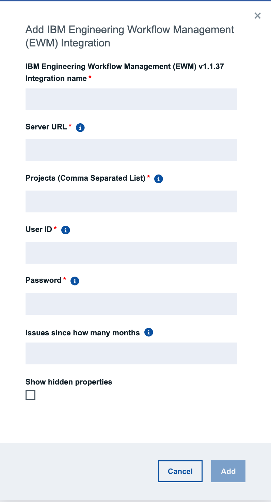
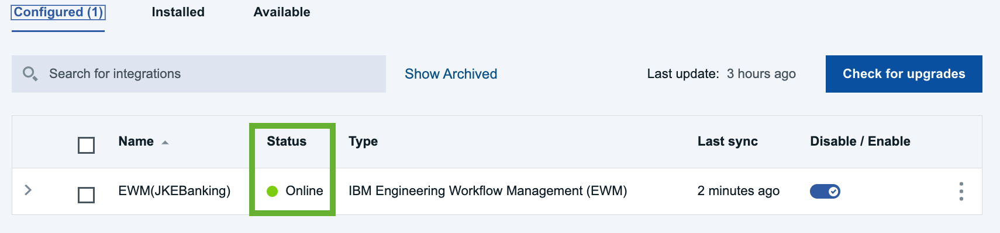

# Configuring the integration between DevOps Velocity and ELM

## Topics covered in this Enablement exercise
### Overview
1. [DevOps Velocity Overview](#devops-velocity-overview) 
2. [What is a Velocity Plugin](#what-is-a-velocity-plugin) 
3. [Understanding DevOps Velocity's value stream map file](#understanding-devops-velocitys-value-stream-map-file)
### Working with EWM
4. [Configuring the plugin to integrate DevOps Velocity and EWM](#configuring-the-plugin-to-integrate-devops-velocity-and-ewm)
5. [Creating the EWM Value Stream in DevOps Velocity](#creating-the-ewm-value-stream-in-devops-velocity)
6. [Architecting the value stream aligned to the EWM Artifact Workflow](#architecting-the-value-stream-aligned-to-the-ewm-artifact-workflow)
### Working with ERM
7. [Preparing RM projects (reg mgmt and global configurations) for integration with Velocity](#preparing-rm-projects-reg-mgmt-and-global-configurations-for-integration-with-velocity)
8. [Configuring the plugin to integrate DevOps Velocity with ERM (DOORs NG req mgmt project)](#configuring-the-plugin-to-integrate-devops-velocity-with-erm-doors-ng-req-mgmt-project)
9. [Configuring the plugin to integrate DevOps Velocity with ERM (DOORs NG global configuration)](#configuring-the-plugin-to-integrate-devops-velocity-with-erm-doors-ng-global-configuration)
10. [Creating the ERM Value Stream in DevOps Velocity](#creating-the-erm-value-stream-in-devops-velocity)
11. [Architecting the value stream aligned to the ERM Artifact Workflow](#architecting-the-value-stream-aligned-to-the-erm-artifact-workflow)

## Overview 

### DevOps Velocity Overview

DevOps Velocity is a multi-container application installed in a Kubernetes container management system. 
 
 

The DevOps Velocity value stream’s view provides a strategic window into your life-cycle workflow while simultaneously enabling you to drill-down and monitor individual elements with the intent of optimizing pipeline flow. These elements typically represent work items/issues, commits, pull requests, builds, deployments, and tests that are collected from many tools making up your delivery pipeline and integrated into Velocity via plugins. Individual elements are represented graphically by small circles, squares, or triangles, depending on the type, providing information from logically related tools, such as issues managed in an ALM solution linked to one’s source control management (SCM) system. How elements are visualized in a DevOps Velocity value stream can be simple to very complex. You are only limited by your knowledge of how to architect a value stream.

The pipeline capability enables organizations to drive releases by using application-focused methods. Add applications to logical environments and let DevOps Velocity generate basic release plans required to deploy the applications. Use quality gates to implement an enhanced level of automated governance helping organizations reduce business risk as software change moves through the delivery pipeline to the production environment.

DevOps Velocity’s enterprise-scale release management capabilities supports both cloud-native and on-premises deployment. Use DevOps Velocity to move releases through all of your development life-cycle environments including development, testing, and production. Create a predictable schedule of releases for your software applications. Share release statuses with all stakeholders so that they know the schedules, the key milestones, current status, and issues that may delay releases.

The Insights view helps organizations to assess the efficiency of product teams and the speed at which they are able to deliver value to the end users. Teams can measure every aspect of the development lifecycle with the supplied charts. Teams can create their own charts with metric definitions and upload custom data to DevOps Velocity using the Application programming interface (API) endpoints. Since data sources also encompass plug-ins and API calls, project data can come from virtually anywhere, including planning and development tools, testing and building applications, and deployment solutions.

In this demonstration, you will focus on the Value Stream and Insights views.

For more information about DevOps Velocity, visit [Velocity's product documentation page](https://www.ibm.com/docs/en/devops-velocity/5.1.0?topic=high-level-overview).
 

[Return to List of Enablement Topics](#topics-covered-in-this-enablement-exercise)
 

### What is a Velocity Plugin

Included as part of a Velocity installation are plugins which allow the Velocity Administrator to create connections between delivery pipeline applications and synchronize data between Velocity and the target application source (ELM, Jira, GitHub, DevOps Control, etc). Each plugin defines an expected record type and communication method. Communication can be uni-directional or bi-directional. To use a plug-in, you must configure an integration. There are multiple ways to configure an integration:
- Create an integration definition on the Plugins tab of the Integrations page.
- Install the plug-in and then create an integration definition.
- Add an integration definition to a value stream JSON file.
- Configure a deployment plan task for one of the native integration types.

In total there are over 45 plugins available.

Once configured and as per that plugin’s synchronization timing, Velocity starts a plugin container image, makes the connection with the target application, and retrieves all data changes from the last sync time. NOTE: that sync time duration will vary depending on the amount of data being added to Velocity’s MongoDB repository.

 

[Return to List of Enablement Topics](#topics-covered-in-this-enablement-exercise)
 

### Understanding DevOps Velocity's value stream map file
 

| **Step** | **Details**  | **Additional Information** |
| ------------- | ------------- | ------------- |

[Return to List of Enablement Topics](#topics-covered-in-this-enablement-exercise)
 

## Working with EWM

### Configuring the plugin to integrate DevOps Velocity and EWM

The purpose of this exercise is to provide instruction on how to integration DevOps Velocity with EWM. It is assumed that the ELM server has already been setup and that an EWM project has been configured. For this lab exercise we will be using the JKE Banking sample application available with ELM.
  

| **Step** | **Details**  | **Additional Information** |
| ------------- | ------------- | ------------- |
| 1 | To access the Velocity plugin interface, open Velocity in a browser and log in.   (uid: admin / pwd: admin) |   |
| 2 | Click on the settings icon. (Top RHS browser window) |  |
| 3 | Select Integrations from the LHS navigation bar. |  |
| 4 | Click on the Installed tab and review the many plugins already available. |  |
| **NOTE:** | While this exercise does not cover all topics related to plugins, know that administrator users can install additional plugins from the "Available" tab or upload custom plugins using the "Load Plugin" feature. |  |
| 5 | In the search control, enter “EWM”. |  |
| 6 | Click the twisty icon for the EWM plugin and note that there are multiple versions of this plugin available for installation. |  |
| 7 | Click the "Add Integration" button (RHS of page) for IBM Engineering Workflow Management (EWM) v1.1.37. |  |
| 8 | Working in the pop up window enter the following values into the fields on the form:     **Integration name:** EWM(JKEBanking)  **Server URL:** TODO: need to update  **Projects (Comma Separated List):** JKE Banking (Change Management)  **User ID:** sysadmin  **Password:** passw0rd  **Show hidden properties:** enabled  **Logging level:** ALL   |  |
| 9 | Click the "Add" button when done. |  |
| 10 | Click the Configured tab on the Integrations page. |  |
| 11 | After a few seconds, confirm that the integration Status shows online. |   |
| 12 | Click the 3 dots on RHS integration and select "View Logs" from the options presented. |   |
| **NOTE:** |  If the status is not showing as Online, ensure the ELM Server is available. If the server is running, check the plugin settings to ensure they are properly set  by selecting Edit. |  |
| 13 | Select the Log file and view output contents |  |

Congratulations on successfully configuring the EWM Plugin.

[Return to List of Enablement Topics](#topics-covered-in-this-enablement-exercise)
 

### Creating the EWM Value Stream in DevOps Velocity
 

| **Step** | **Details**  | **Additional Information** |
| ------------- | ------------- | ------------- |

[Return to List of Enablement Topics](#topics-covered-in-this-enablement-exercise)
 

### Architecting the value stream aligned to the EWM Artifact Workflow
 

| **Step** | **Details**  | **Additional Information** |
| ------------- | ------------- | ------------- |

[Return to List of Enablement Topics](#topics-covered-in-this-enablement-exercise)
 

## Working with ERM

### Preparing RM projects (reg mgmt and global configurations) for integration with Velocity
 

| **Step** | **Details**  | **Additional Information** |
| ------------- | ------------- | ------------- |

[Return to List of Enablement Topics](#topics-covered-in-this-enablement-exercise)
 

### Configuring the plugin to integrate DevOps Velocity with ERM (DOORs NG req mgmt project)
 

| **Step** | **Details**  | **Additional Information** |
| ------------- | ------------- | ------------- |

[Return to List of Enablement Topics](#topics-covered-in-this-enablement-exercise)
 

### Configuring the plugin to integrate DevOps Velocity with ERM (DOORs NG global configuration)
 

| **Step** | **Details**  | **Additional Information** |
| ------------- | ------------- | ------------- |

[Return to List of Enablement Topics](#topics-covered-in-this-enablement-exercise)
 

### Creating the ERM Value Stream in DevOps Velocity
 

| **Step** | **Details**  | **Additional Information** |
| ------------- | ------------- | ------------- |

[Return to List of Enablement Topics](#topics-covered-in-this-enablement-exercise)
 

### Architecting the value stream aligned to the ERM Artifact Workflow
 

| **Step** | **Details**  | **Additional Information** |
| ------------- | ------------- | ------------- |

[Return to List of Enablement Topics](#topics-covered-in-this-enablement-exercise)
 

