# Configuring the integration between DevOps Velocity and ELM

## Topics covered in this Enablement exercise

### Overview

1. [DevOps Velocity Overview](#devops-velocity-overview)
2. [What is a Velocity Plugin](#what-is-a-velocity-plugin)
3. [DevOps Velocity's value stream map overview](#devops-velocitys-value-stream-map-overview)

### Integrating DevOps Velocity with EWM

4. [Configuring the plugin to integrate DevOps Velocity and EWM](#configuring-the-plugin-to-integrate-devops-velocity-and-ewm)
5. [Creating the EWM Value Stream in DevOps Velocity](#creating-the-ewm-value-stream-in-devops-velocity)
6. [Editing the value stream map template to visualize EWM Artifact Workflow](#editing-the-value-stream-map-template-to-visualize-ewm-artifact-workflow)

### Integrating DevOps Velocity with ERM

7. [Preparing RM projects (reg mgmt and global configurations) for integration with Velocity](#preparing-rm-projects-reg-mgmt-and-global-configurations-for-integration-with-velocity)
8. [Configuring the plugin to integrate DevOps Velocity with ERM (DOORs NG req mgmt project)](#configuring-the-plugin-to-integrate-devops-velocity-with-erm-doors-ng-req-mgmt-project)
9. [Configuring the plugin to integrate DevOps Velocity with ERM (DOORs NG global configuration)](#configuring-the-plugin-to-integrate-devops-velocity-with-erm-doors-ng-global-configuration)
10. [Creating the ERM Value Stream in DevOps Velocity](#creating-the-erm-value-stream-in-devops-velocity)
11. [Editing the value stream map template to visualize EWM Artifact Workflow](#editing-the-value-stream-map-template-to-visualize-erm-artifact-workflow)

## About this Enablement Exercise
This lab is not a complete enablement activity teaching individuals on the full features or functionality of DevOps Velocity and/or ELM. This enablement exercise simply focuses on integrating the two IBM solutions - ELM and DevOps Velocity. To learn more about the individual solutions, review the product documentation for available tutorials and learning exercises. While there is some informational material provided, it is only to help establish foundational knowledge for those performing the steps below.

[DevOps Velocity's learning page](https://www.ibm.com/docs/en/devops-velocity/5.1.0?topic=learning) 
[IBM ELM's learning resources page](https://www.ibm.com/docs/en/engineering-lifecycle-management-suite/lifecycle-management/7.0.3?topic=management-learning-resources)

## Section: Overview

### DevOps Velocity Overview

DevOps Velocity is a multi-container application installed in a Kubernetes container management system.

The DevOps Velocity value stream view provides a strategic window into your life-cycle workflow while simultaneously enabling you to drill-down and monitor individual elements with the intent of optimizing your software delivery pipeline flow. These elements typically represent work items/issues, commits, pull requests, builds, deployments, and tests that are collected from many tools making up your delivery pipeline and integrated into Velocity via plugins. Individual elements are represented graphically by small circles, squares, or triangles, depending on the type, providing information from logically related tools, such as issues managed in an ALM solution linked to one’s source control management (SCM) system. How elements are visualized in a DevOps Velocity value stream can be simple to very complex. You are only limited by your knowledge of how to architect a value stream.

The pipeline capability enables organizations to drive releases by using application-focused methods. Add applications to logical environments and let DevOps Velocity generate basic release plans required to deploy the applications. Use quality gates to implement an enhanced level of automated governance helping organizations reduce business risk as software change moves through the delivery pipeline to the production environment.

DevOps Velocity’s enterprise-scale release management capabilities supports both cloud-native and on-premises deployment. Use DevOps Velocity to move releases through all of your development life-cycle environments including development, testing, and production. Create a predictable schedule of releases for your software applications. Share release statuses with all stakeholders so that they know the schedules, the key milestones, current status, and issues that may delay releases.

The Insights view helps organizations to assess the efficiency of product teams and the speed at which they are able to deliver value to the end users. Teams can measure every aspect of the development lifecycle with the supplied charts. Teams can create their own charts with metric definitions and upload custom data to DevOps Velocity using the Application programming interface (API) endpoints. Since data sources also encompass plug-ins and API calls, project data can come from virtually anywhere, including planning and development tools, testing and building applications, and deployment solutions.

For more information about DevOps Velocity, visit [Velocity's product documentation page](https://www.ibm.com/docs/en/devops-velocity/5.1.0?topic=high-level-overview).
 

[Return to List of Enablement Topics](#topics-covered-in-this-enablement-exercise)
 

### What is a Velocity Plugin

Included as part of a Velocity installation are plugins which allow the Velocity Administrator to create connections between delivery pipeline applications and synchronize data between Velocity and the integrated application's repository data (ELM, Jira, GitHub, DevOps Control, etc). Each plugin defines an expected record type and communication method. Communication can be uni-directional or bi-directional. To use a plug-in, you must first configure an integration. There are multiple ways to configure an integration:

- Create an integration definition on the Plugins tab of the Integrations page.
- Install the plug-in and then create an integration definition.
- Add an integration definition to a value stream JSON file.
- Configure a deployment plan task for one of the native integration types.

For a full list of available plugins, visit the [DevOps Velocity plugin page](https://urbancode.github.io/IBM-UCx-PLUGIN-DOCS/UCV/)

Once configured and as per that plugin’s synchronization timing, Velocity starts a plugin container image, makes the connection with the target application, and retrieves all data changes from the last sync time. **NOTE:** that sync time duration will vary depending on the amount of data being added to Velocity’s MongoDB repository.
 

[Return to List of Enablement Topics](#topics-covered-in-this-enablement-exercise)
 

### DevOps Velocity's value stream map overview

A Value Stream map file is used to describe the phases and stages a work item or artifact will go through from inception to implementation displaying the work items in their current state.

The highest level of a value stream is a phase. Phases represent important, organizational parts of the value stream, such as "Planning," or "Development." On the Value stream view, processing is done in left-right order. For example, your first phase might be for planning and contain items created in an issue tracking system. Your next phase, used for development, can track source control activity related to the issues, and any builds triggered by the activity. Your final phase, used for deployment, might track the related build artifacts as they move through your testing environments toward production.

Phases contain stages that define process flow within a phase. A development phase that integrates a source control tool might contain an In Progress stage followed by In Review and Merged stages. When you customize a value stream, you define the phases and stages and their order.

Stages are containers for dots. Dots represent units of work from DevOps Velocity or tools that are integrated into the value stream. Git commits or EWM work items, to take just two, are represented by individual dots. Work items, such as commits and builds, can be combined into individual dots. A dot's position in the value stream conveys important information about the object. Dots in a stage named Merged might represent items merged into Git repositories. An item's shape and color convey information about the item's type and status. A dot outlined in red, for example, might mean the item is past schedule. When dots change state, they move to new stages in near-real time. Finally, when you click on a dot, the displayed card provides information about the work items, including their history, and provides links to associated tools.

For this purposes of this enablement exercise, a very simple approach was followed in archtitecting the value stream. The phases and stages were mapped to the artifact workflows defined in EWM showing only the current state of the user stories, defects, and tasks.

Reviewing the Value Stream Map image, notice the following:

1. Definition of the four phases - Open, In Progress, Approval, Released
2. Within the Open phase there are two stages named New and ReOpened
3. The query statement in the Open stage instructs Velocity to display all work items which are currently in a New state.
4. The query statement in the ReOpened stage instructs Velocity to display only work items of type Defect which in an ReOpened state.
5. And finally the target stanza on each stage helps to visualize the next stage that a work item could be displayed in.

For the purposes of this enablement exercise, a template has been created to help bootstrap creation and configuration of the value stream.

If you would like to review the entire VSM template, open the link in a new browser tab:
[EWM VS map Template](https://github.com/DevOpsAutomationLabs/ELM_Velocity/raw/main/files/EWM_defaultWorkflow-vsm.json)
 

[Return to List of Enablement Topics](#topics-covered-in-this-enablement-exercise)
 

## Section: Integrating DevOps Velocity with EWM

To visualize EWM artifacts as "DOTS" in a DevOps Velocity value stream, three basic steps must happen: 

1. Configure a plugin to allow Velocity to communicate with EWM. 
2. Create a Value Stream to provide a dashboard user interface to visualize the "DOTS". 
3. Architect the Value Stream by editing the Value Stream Map (json file) to replicate the workflows being used in EWM. 

### Configuring the plugin to integrate DevOps Velocity and EWM

The purpose of this exercise is to provide instruction on how to setup the integration between DevOps Velocity with EWM. It is assumed that the ELM server has already been setup and that an EWM project has been configured. For this lab exercise we will be using the JKE Banking MTM sample application available with ELM.
 

| **Step** | 
**Details**
  | **Additional Information** |
|:-------------:|:------------- |:------------- |
| 1 | To access the Velocity plugin interface, open Velocity in a browser and log in.   (uid: admin / pwd: admin) |  |
| 2 | Click on the "Settings" icon. (top RHS of browser window) |  |
| 3 | Select "Integrations" (LHS navigation bar of browser window). | 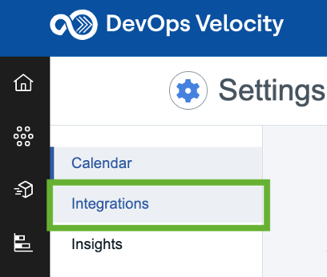 |
| 4 | Click on the "Installed" tab and review the many plugins already available. |  |
| **NOTE:** | While this exercise does not cover all topics related to plugins, know that administrator users can install additional plugins from the "Available" tab or upload custom plugins using the "Load Plugin" feature. |  |
| 5 | In the search control, enter “EWM”. | 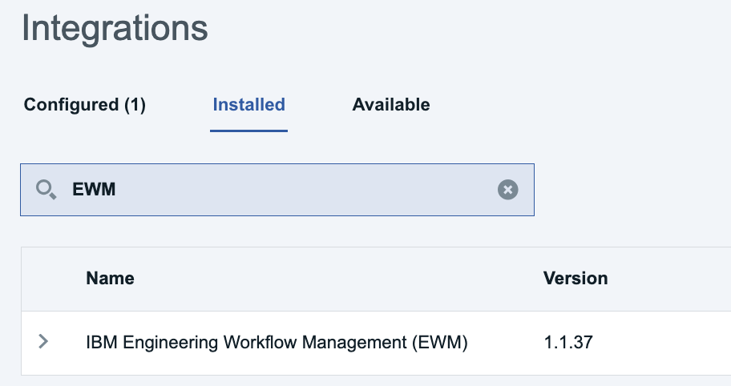 |
| 6 | Click the "Add Integration" button (RHS of the browser window) for IBM Engineering Workflow Management (EWM) v1.1.34. |  |
| 7 | Working in the pop up window enter the following values into the fields on the form:     **Integration name:** EWM(JKEBanking)  **Server URL:** https://ibmjazz.net/ccm  **Projects (Comma Separated List):** JKE Banking (Change Management)  **User ID:** sysadmin  **Password:** passw0rd (0=zero)  **Show hidden properties:** enabled  **Logging level:** ALL   |  |
| 8 | Click the "Add" button when done. |  |
| 9 | Click the "Configured" tab on the Integrations page. |  |
| 10 | After a few seconds, confirm that the integration Status shows "Online". |   |
| 11 | Click the "3 dots" on the RHS of integration line and select "View Logs" from the options presented. |   |
| **NOTE:** |  If the status is not showing as Online, ensure the ELM Server is available. If the server is running, check the plugin settings to ensure they are properly set by clicking "Edit". |  |
| 12 | Select the first log file and view output contents. |  |
| **Note:** | Log files roll off so if you need to retain access to a log file, click the "Download log file" button. |   |

Congratulations on successfully configuring the EWM Plugin.

[Return to List of Enablement Topics](#topics-covered-in-this-enablement-exercise)
 

### Creating the EWM Value Stream in DevOps Velocity

Visualizing the "Dots" (Stories, Tasks, Defects) on a value stream dashboard requires that a Value Stream be created. This section will share instructions on how to create the Value Stream.

| **Step** | 
**Details**
  | **Additional Information** |
|:-------------:|:------------- |:------------- |
| 1 | Continuing to work in DevOps Velocity, navigate to the "Value streams" view page. | 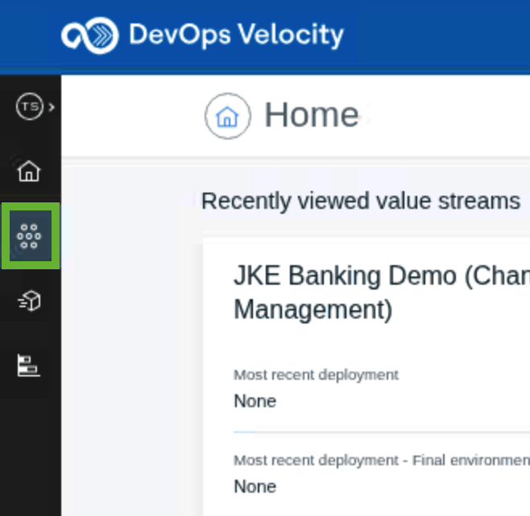 |
| 2 | Click the "All value streams" (top RHS of browser window). |  |
| 3 | Click the "Create value stream" button. | 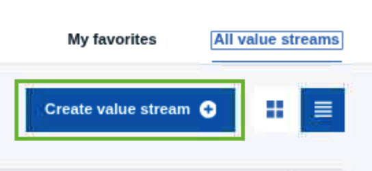 |
| 4 | On the pop-up window, enter a meaningful name, and select "Default Team" from the Team drop down list box.   e.g. JKE Banking (Change Management) |  |
| 5 | Click the "Create" button. |  |
| **NOTE:** | Clicking the "Create & Configure" button will lead the user through a series of conifguration windows offering a wizard driven approach to creating the value stream. |  |
| 6 | You should now be presented with a basic value stream visualization. |  |

Congratulations on successfully configuring a basic DevOps Velocity value stream.

[Return to List of Enablement Topics](#topics-covered-in-this-enablement-exercise)
 

### Editing the value stream map template to visualize EWM Artifact Workflow

As previously mentioned, this enablement exercise is using a value stream template file to bootstrap the value stream creating process. More more information about configuring the value stream map file refer to section [DevOps Velocity's value stream map overview](#devops-velocitys-value-stream-map-overview).

However, even though much of the value stream architecture work has already been completed, specific edits still need to be made to the template adding the plugin integration name so that Velocity knows which collection of data should be visualized in the value stream.

| **Step** | 
**Details**
  | **Additional Information** |
|:-------------:|:------------- |:------------- |
| 1 | Continuing to work in the newly created value stream view, locate and click on the "wrench" icon (top RHS of browser window). |  |
| 2 | Select the "Edit value stream map" option. |  |
| 3 | Open the EWM VS map file in a new browser tab.   Link to file provided in Additional Information. | [EWM VS map Template](https://github.com/DevOpsAutomationLabs/ELM_Velocity/raw/main/files/EWM_defaultWorkflow-vsm.json) |
| 4 | Working in the new browser tab, select/highlight the entire VS map code, and copy to the clipboard. |  |
| 5 | Returning to the value stream map editor in DevOps Velocity, select/highlight the entire contents of the editor and replace by pasting in the template code from the clipboard. |  |
| 6 | Working in the DevOps Velocity value stream editor, locate the "integrations" stanza within the json file (near end of the json file). |  |
| 7 | Replace the "EWM integration name" text string with the name of your EWM plugin.   e.g. EWM(JKEBanking) |  |
| 8 | Save and verify that the change was saved successfully. |  |
| **NOTE:** | DevOps Velocity offers version control (out of the box) to help in managing value stream map changes. With the recent change, note the addition of a new version. |  |
| 9 | Click the "Back" button to return to the value stream view. |  |
| 10 | You should now see a re-configured value stream architecture with "DOTS" aligned to the phases and stages defined in the EWM workflow. |  |
| **NOTE:** | Retrieving the "Dots" may take a couple of seconds. Refresh the browser page. | |
| 11 | To arrange the Stages and location of Stages on the value stream view, enable the drag feature by clicking on the "pencil" icon located on the mini toolbar (LHS of value stream view). |  |
| 12 | Hover the mouse cursor over one of the stages. Click and hold the mouse button while moving the stage into the desired position. Release the mouse button when the stages is positioned as desired. **NOTE:** The image to the right shows an orientation where lines are not bisecting stages and provides an easy to read layout. |  |
| 13 | Disable the drag feature when done by clicking on the "pencil" icon. |  |

Congratulations on successfully configuring the DevOps Velocity value stream to visualize EWM artifacts.

[Return to List of Enablement Topics](#topics-covered-in-this-enablement-exercise)
 

## Section: Integrating DevOps Velocity with ERM

Due to the tremendous flexibility provided to clients using ERM (DOORs NG) for requirements management, certain setup steps are necessary to properly integrate with ERM and visualize the requirement artifact types in a DevOps Velocity value stream. Know that all setup steps align to best practices users should be following.

Because users can create new artifact types and artifact attributes, including attributes to capture status, it was decided that in order to visualize requirements in DevOps Velocity and track status of those requirements, users must specify a project workflow for the artifact type.

Also, as there are many types of requirements, some of which the user would not visualize in Velocity, shared views must be configured allowing Velocity's DOORs NG plugin to know exactly which artifact type to sync on.

This enablement exercise will walk through the steps to: 

1. Prepare the RM project to be able to synchronize with Velocity. 
2. Configure plugins for RM projects regardless of whther they have been enabled for Global Configuration or not. 
3. Create the Value Streams to visualize both a requirements management project and a global configuration project. 

### Preparing RM projects (reg mgmt and global configurations) for integration with Velocity

To complete the following exercise, ERM has been setup with two requirements projects: 

1. JKE Banking (Requirements Management) 
2. Meter Reader GC (Global Configuration) 

| **Step** | 
**Details**
  | **Additional Information** |
|:-------------:|:------------- |:------------- |
| 1 | Launch ERM in a Google browser window using the shortcut provided and authenticate with the ELM environment.  (uid: sysadmin / pwd: passw0rd) |  |
| 2 | Select "JKE Banking (Requirements Management)" from the list of projects displayed. | 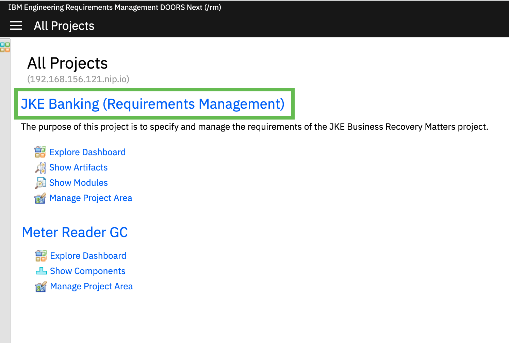 |
| 3 | Click on the gear icon (top LHS of browser window) and select "Manage Project Properties" from the options presented. |  |
| 4 | Working in the Artifact Types list box, locate and select the "Feature" artifact type. |  |
| 5 | In the editor window for the Feature artifact type, click on the "Workflow" control and select the workflow used to architect the value stream.   In this exercise, the default workflow was used to architect the value stream. |  |
| 6 | Save the changes and repeat steps 4 and 5 setting the workflow for Artifact types "Use Case Requirement" and "User Story Elaboration" saving the changes each time. |  |
| **NOTE:** | The requirement types chosen for this enablement exercise don't necessarily represent all Artifact Types a user may want to visualize in Velocity. However the steps are the same regardless of the Artifact type. |  |
| 7 | Click on the "Artifacts" tab in the ELM navigation bar. |  |
| 8 | Select "All" Artifacts, select "Views" and clear all filters. | 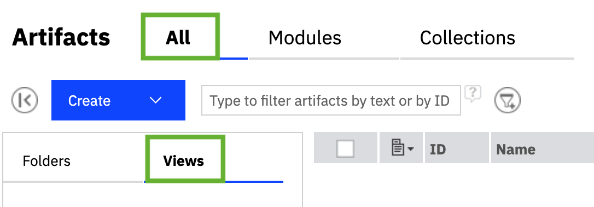 |
| 9 | Click on the "Add filter" icon. |  |
| 10 | Select "Artifact Type" as the attribute and select "Feature", "Use Case Requirement", and "User Story Elaboration" as the Artifact type values. | 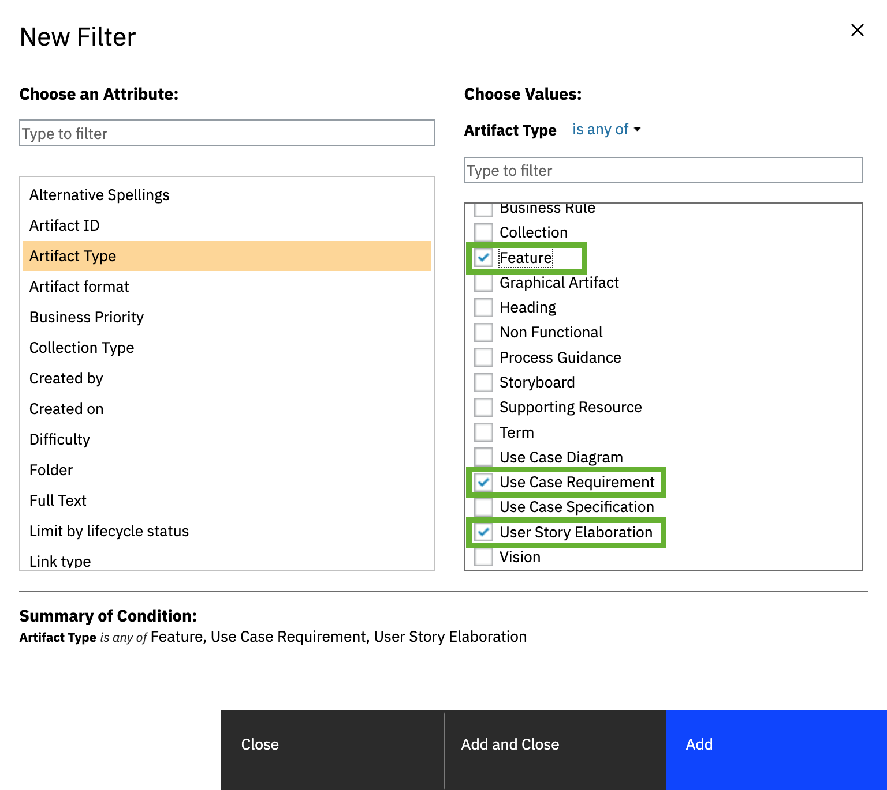 |
| 11 | Click "Add and Close". |  |
| 12 | Click the "Save as new view" icon. |  |
| 13 | Enter a meaningful name (e.g. Velocity_Types), select "Shared", and click "OK". |  |
| **NOTE:** | If the userid/password combination used to configure the Velocity plugin is not an "ELM Administrator". The userid must have access to the DOORs NG project and must be able to execute views. |  |
| 14 | The same process described above is used to prepare a Global Configuration project for integration with DevOps Velocity with the following differences: 1. The project selected will be different (step 2). For this enablement exercise, select Meter Reader GC. 2. When you click on the gear icon (step 3), select "Manage Component Properties ". 3. Select "Stakeholder Requirements" and "System Requirements" artifact types when setting the workflow and creating the views. | 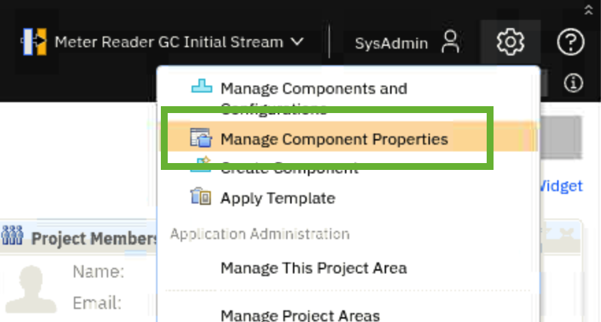 |
| **HINT:** | Creating an individual view for each of the Artifact types provides more flexibility in selecting which Artifact types you want to sync with DevOps Velocity. |  |
| 15 | For the Meter Reader GC project, create a view named Velocity_SystemRequirement for the System Requirement Artifact type and a view called Velocity_StakeholderRequirement for the Stakeholder Requirement Artifact type. | 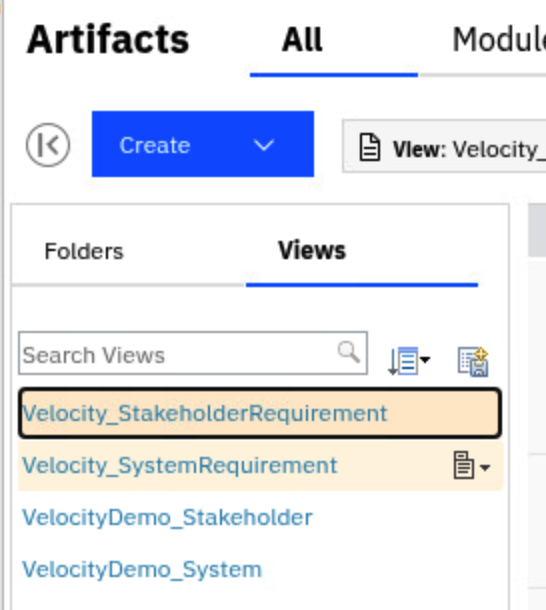 |
| **HINT:** | It is recommended to prefix the View name with Velocity so that the view is not accidently deleted or modified. |   |

Congratulations on successfully preparing the RM projects and Artifact types for visualization in DevOps Velocity.

[Return to List of Enablement Topics](#topics-covered-in-this-enablement-exercise)

### Configuring the plugin to integrate DevOps Velocity with ERM (DOORs NG req mgmt project)

The purpose of this exercise is to provide instruction on how to setup the integration between DevOps Velocity with ERM. More specifically a DOORs NG requirements management project. It is assumed that the ELM server has already been setup and that a DOORs NG requirements management project has been configured. For this lab exercise we will be using the JKE Banking (Requirements Management) sample project already available with ELM.

| **Step** | 
**Details**
  | **Additional Information** |
|:-------------:|:------------- |:------------- |
| 1 | To access the Velocity plugin interface, open Velocity in a browser and log in using the shortcut provided in the Chrome browser.   (uid: admin / pwd: admin) |   |
| 2 | Click on the "Settings" icon. (Top RHS of browser window) |  |
| 3 | Select "Integrations" (LHS navigation bar of browser window). |  |
| 4 | Click on the "Installed" tab and review the many plugins already available. |  |
| **NOTE:** | While this exercise does not cover all topics related to plugins, know that administrator users can install additional plugins from the "Available" tab or upload custom plugins using the "Load Plugin" feature. |  |
| 5 | In the search control, enter “DOORs”. |  |
| 6 | Click the "Add Integration" button (RHS of browser window) for the IBM Engineering Requirements Management (Doors) v1.0.102 plugin. | 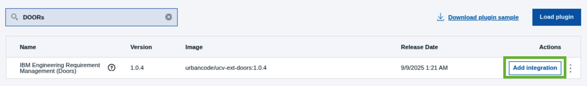 |
| 7 | Working in the pop up window enter the following values into the fields on the form:     **Integration name:** DOORS(JKEBanking)  **Server URL:** https://ibmjazz.net:9443/rm  **Project:** JKE Banking (Requirements Management)  **Views (Comma Seperated List):** Velocity_Types  **User ID:** sysadmin  **Password:** passw0rd (0=zero)  **Show hidden properties:** enabled  **Logging level:** ALL   |  |
| 8 | Click the "Add" button when done. |  |
| 9 | Click the "Configured" tab on the Integrations page. |  |
| 10 | After a few seconds, confirm that the integration Status shows online. |   |
| 11 | Click the "3 dots" on the RHS of integration line and select "View Logs" from the options presented. View the contents of the first log file entry. |  |

Congratulations on successfully configuring the ERM Plugin to integrate DevOps Velocity with a DOORs NG requirements management project.

[Return to List of Enablement Topics](#topics-covered-in-this-enablement-exercise)
 

### Configuring the plugin to integrate DevOps Velocity with ERM (DOORs NG global configuration)
The purpose of this exercise is to provide instruction on how to setup the integration between DevOps Velocity with ERM. More specifically a DOORs NG Global Configuration project. It is assumed that the ELM server has already been setup and that a DOORs NG Global Configuration project has been configured. For this lab exercise we will be using the Meter Reader GC sample global configuration available with ELM.
 

| **Step** | 
**Details**
  | **Additional Information** |
|:-------------:|:------------- |:------------- |
| 1 | To access the Velocity plugin interface, open Velocity in a browser and log in using the shortcut available in the Chrome browser.   (uid: admin / pwd: admin) |   |
| 2 | Click on the "Settings" icon. (Top RHS of browser window) |  |
| 3 | Select "Integrations" (LHS navigation bar of browser window). |  |
| 4 | Click on the "Installed" tab and review the many plugins already available. |  |
| **NOTE:** | While this exercise does not cover all topics related to plugins, know that administrator users can install additional plugins from the "Available" tab or upload custom plugins using the "Load Plugin" feature. |  |
| 5 | In the search control, enter “DOORs”. |  |
| 6 | Click the "Add Integration" button (RHS of browser page) for the IBM Engineering Requirements Management (Doors) v1.0.4 plugin. |  |
| 7 | Working in the pop up window enter the following values into the fields on the form:     **Integration name:** DOORS(MeterReaderGC)  **Server URL:** TODO: need to update  **Global Configuration Name:** Meter Reader GC  **Component Name:** Meter Reader GC  **Stream Name:** Meter Reader GC Initial Stream  **Views (Comma Seperated List):** Velocity_StakeholderRequirements,Velocity_SystemRequirements  **User ID:** sysadmin  **Password:** passw0rd (0=zero)  **Show hidden properties:** enabled  **Logging level:** ALL   |  |
| 8 | Click the "Add" button when done. |  |
| 9 | Click the "Configured" tab on the Integrations page. |  |
| 10 | After a few seconds, confirm that the integration Status shows "Online". |   |
| 11 | Click the "3 dots" on the RHS of integration line and select "View Logs" from the options presented. View the contents of the first log file entry. |  |

Congratulations on successfully configuring the ERM Plugin to integrate DevOps Velocity with a DOORs NG Global Configuration project.

[Return to List of Enablement Topics](#topics-covered-in-this-enablement-exercise)
 

### Creating the ERM Value Stream in DevOps Velocity

Visualizing the requirements (artifact types) on a value stream dashboard requires a Value Stream created. This section will share instructions on how to create the Value Stream.

| **Step** | 
**Details**
  | **Additional Information** |
|:-------------:|:------------- |:------------- |
| 1 | Continuing to work in DevOps Velocity, navigate to the "Value Stream" view page. |  |
| 2 | Click the "All value streams" tab (top RHS of browser window). |  |
| 3 | Click the "Create" button. |  |
| 4 | On the pop-up window, enter a meaningful name e.g. JKE Banking (Requirements Management), and select Default team from the Team drop down list box. | 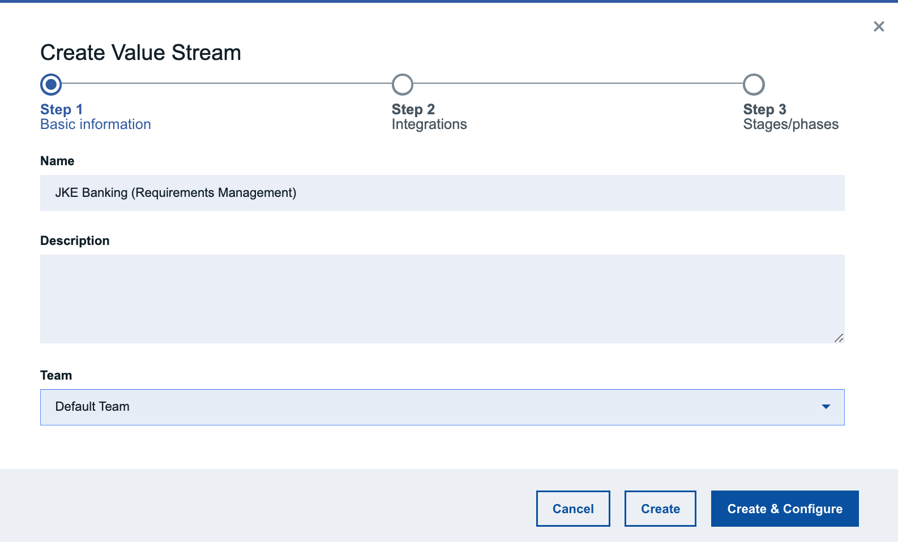 |
| **Note:** | To create a value stream for a Global Configuration project, the steps are the same as previous shared. The only difference with be the Value Stream name entered. | Meter Reader GC vs. JKE Banking (Requirements Management) |
| 5 | Click the "Create" button. |  |
| 6 | You should now be presented with a basic value stream visualization. |  |
| 7 | Repeat the above steps creating a new value stream for the Meter Reader GC global configuration project. |  |

Congratulations on successfully configuring a basic DevOps Velocity value stream to visualize ERM artifacts.

[Return to List of Enablement Topics](#topics-covered-in-this-enablement-exercise)
 

### Editing the value stream map template to visualize ERM Artifact Workflow

As previously mentioned, this enablement exercise is using a value stream template file to bootstrap the value stream creating process. More more information about configuring the value stream map file refer to section [DevOps Velocity's value stream map overview](#devops-velocitys-value-stream-map-overview).

However, even though much of the value stream architecture work has already been completed, specific edits still need to be made to the template adding the plugin integration name as well as the project name so that Velocity knows which collection of data should be visualized in the value stream.

| **Step** | 
**Details**
  | **Additional Information** |
|:-------------:|:------------- |:------------- |
| 1 | Continuing to work in the newly created value stream view, locate and click on the "wrench" icon. |  |
| 2 | Select the "Edit value stream map" option. |  |
| 3 | Open the ERM VS map file in a browser tab.| [ERM VS map Template](https://github.com/DevOpsAutomationLabs/ELM_Velocity/raw/main/files/DOORs_defaultWorkflow-vsm.json) |
| 4 | Working in the new browser tab, select/highlight the entire VS map code, and copy. |  |
| 5 | Returning to the value stream map editor in Velocity, select/highlight the entire contents of the editor and replace by pasting in the template code. |  |
| 6 | Working in the DevOps Velocity value stream editor, locate the global "query" line within the json file at top of the file. |  |
| 7 | Replace the "Project Name" text string with the name of your ERM project name.   e.g. JKE Banking (Requirements Manangement) |  |
| 8 | Working in the DevOps Velocity value stream editor, locate the "integrations" stanza within the json file near end of the file. |  |
| 9 | Replace the "EWM integration name" text string with the name of your EWM plugin.   e.g. EWM(JKEBanking) |  |
| 10 | Verify that the update was saved successfully. |  |
| 11 | Click the "Back" button to return to the value stream view. |  |
| 12 | You should now see a re-configured value stream architecture with "DOTS". | 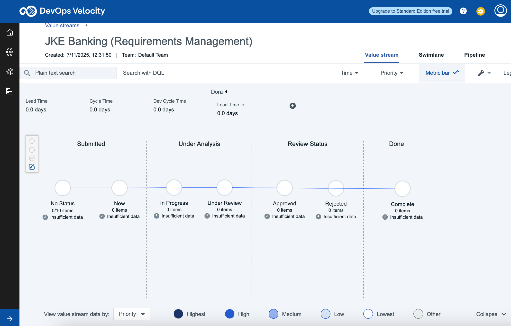 |
| 13 | To arrange the Stages and location of Stages on the value stream view, enable the drag feature by clicking on the "pencil" icon located on the mini toolbar. |  |
| 14 | Hover the mouse cursor over one of the stages. Click and hold the mouse button while moving the stage into the desired position. The image to the right shows an orientation where lines are not bisecting stages and provides an easy to read layout. |  |
| 15 | Disable the drag feature when done. |  |
| 16 | Working in the value stream, locate the "View value stream data by" control and select type from the list of options. | 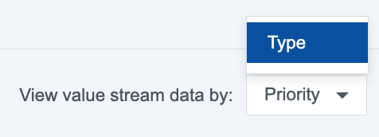 |
| 17 | Notice the color of the "DOTS" and the legend has changed to show the requirement types instead of requirement priority. |  |
| 17 | Repeat the above steps to edit the value stream map file and arrange the stage for the Meter Reader GC global configuration project. |  |

Congratulations on successfully configuring the DevOps Velocity value stream to visualize ERM artifacts.

[Return to List of Enablement Topics](#topics-covered-in-this-enablement-exercise)
 

| Software Installed for Enablement Exercises | Software Version |
|:---- |:----:|
| DevOps Velocity | v5.1.9 |
| Engineering Lifecycle Management | v7.1 SR1 |
